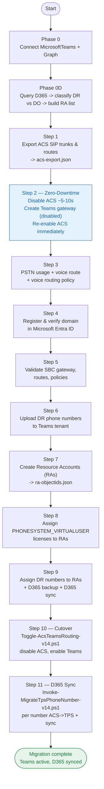
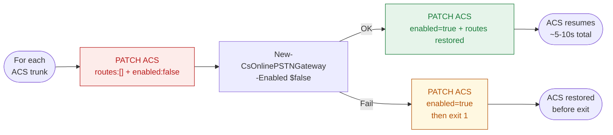
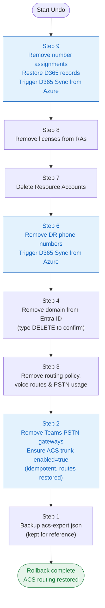

# ACS to Teams Phone Extensibility (TPE) Migration — v14 Scripts

End-to-end automation for migrating Azure Communication Services (ACS) Direct Routing to Teams Phone Extensibility (TPE). Includes full migration, rollback, routing toggle, D365 repair, and utility scripts.

**Evangelists:** Vince Lannotti, Mahesh Sreenivas

**Designers:** Adrian Synal, Vince Lannotti, Chad Madison, Pankaj Yawalkar, Sola Akanmu, Pratichi Dash, Swetha Krovvidi, John Torres, Praneetha Marthala, Heni Karaa, Krishnan Shankar

**Version:** v14.20.0

---

## Contents

- [Prerequisites](#prerequisites)
  - [PowerShell Modules](#powershell-modules)
  - [Permissions Required](#permissions-required)
  - [Config File](#config-file)
- [Scripts](#scripts)
  - [1. Invoke — Full Migration](#1-invoke-acs-tpe-full-migration-v14ps1--full-migration)
  - [2. Undo — Full Rollback](#2-undo-acs-tpe-migration-v14ps1--full-rollback)
  - [3. Toggle — Routing Switch](#3-toggle-acsteamsrouting-v14ps1--routing-toggle)
  - [4. Repair-D365PhoneRecord-v14.ps1](#4-repair-d365phonerecordps1--d365-phone-record-repair)
  - [5. Add-AcsTrunkDisabled-v14.ps1](#5-add-acstrunkdisabledps1--pre-register-acs-trunk)
  - [6. Set-AcsSbcFqdn-v14.ps1](#6-set-acssbcfqdnps1--acs-trunk-management)
  - [7. Test-DomainRegistration-v14.ps1](#7-test-domainregistrationps1--standalone-domain-test)
  - [8. Fix-AcsRoutePattern-v14.ps1](#8-fix-acsroutepatternps1--acs-route-pattern-fix)
  - [9. Get-TeamsProviderSetting-v14.ps1](#9-get-teamsprovidersettingps1--query-d365-teams-provider)
  - [10. Invoke-TeamsPhoneSync-v14.ps1](#10-invoke-teamsphonesyncps1--trigger-phone-number-sync)
  - [11. Update-PhoneNumberType-v14.ps1](#11-update-phonenumbertypeps1--set-phone-number-type)
  - [12. New-AcsTpeConfig-v14.ps1](#12-new-acstpeconfigps1--auto-build-config-from-apis)
  - [13. Invoke-FlipToACS-v14.ps1](#13-invoke-fliptoacsps1--teams-to-acs-rollback)
  - [14. Invoke-FlipToTeams-v14.ps1](#14-invoke-fliptoteamsps1--acs-to-teams-cutover)
  - [15. Invoke-MigrateTpsPhoneNumber-v14.ps1](#15-invoke-migratetpsphonenumberps1--d365-phone-type-migration)
  - [16. Sync-TeamsPhoneNumbers-v14.ps1](#16-sync-teamsphonenumbersps1--d365-ccaas-sync)
  - [17. Archive-TpeRuns-v14.ps1](#17-archive-tperunsps1--clean-up-old-run-logs)
  - [18. Restore-DeletedRoutes-v14.ps1](#18-restore-deletedroutes-v14ps1--restore-accidentally-deleted-voice-routes)
- [Flow Diagrams](#flow-diagrams)
- [Recommended Run Order](#recommended-run-order)
- [Troubleshooting](#troubleshooting)
- [Development (Ralph-Top / AI)](#development-ralph-top--ai)
- [Changelog](#changelog)

---

## Prerequisites

### PowerShell Modules

```powershell
Install-Module MicrosoftTeams            -Scope CurrentUser -Force
Install-Module Microsoft.Graph           -Scope CurrentUser -Force
Install-Module ExchangeOnlineManagement  -Scope CurrentUser -Force
```

### Permissions Required

| System | Role | Required for |
|---|---|---|
| Microsoft Teams | Teams Administrator | All Teams DR operations |
| Microsoft Entra ID | **User Administrator** | Step 7 — `New-CsOnlineApplicationInstance` creates an AAD user object via Graph; Teams Admin alone is not sufficient |
| Microsoft Entra ID | Global Administrator or Domain Administrator | Step 4 — domain registration |
| Azure Communication Services | ACS resource Owner (connection string / access key) | ACS REST API calls |
| Microsoft 365 | License Administrator | Step 8 — license assignment |
| Dynamics 365 | System Administrator or equivalent | D365 sync calls |

> **Note:** Step 7 requires **both** Teams Administrator and User Administrator roles. Missing User Administrator results in `New-CsOnlineApplicationInstance: user not authorized`. Add the role in Entra ID portal → Roles → User Administrator before running Step 7.

### Config File

**Option A — Auto-build (recommended):** Run `New-AcsTpeConfig-v14.ps1` to query Azure, D365, and ACS automatically. Only `Domain` is required as manual input. Output: `new-acs-tpe-config-v14.0.0.json`. See [Script 12](#12-new-acstpeconfigps1--auto-build-config-from-apis).

**Option B — Manual:** Copy `new-acs-tpe-config-*.json` (generated by Option A) to a local file and fill in any missing fields. The `_help` section inside the file explains every parameter.

| Field | Description |
|---|---|
| `TenantId` | Microsoft Entra ID Tenant ID (GUID) |
| `AdminUpn` | Teams / Graph Admin UPN |
| `AcsConnectionString` | Full ACS connection string — `endpoint=https://...;accesskey=...` |
| `SbcFqdn` | SBC FQDN registered in ACS Direct Routing |
| `SbcPort` | SBC SIP signaling port (typically 5075 for ACS DR, 5061 for Teams DR) |
| `Domain` | Custom domain to register in Entra ID (e.g. `cbg-voice.contoso.com`) |
| `AcsResourceId` | ACS Resource ID (GUID) — find in D365 CSAC → Channels → Advanced → Azure Communication Services resource ID. Used by `Sync-CsOnlineApplicationInstance` to link resource accounts to ACS. |
| `DynamicsAppId` | Dynamics 365 application ID for TPE resource accounts |
| `D365OrgUrl` | D365 org URL, e.g. `https://contoso.crm.dynamics.com` |
| `CommsProviderId` | D365 Communications Provider Setting ID — required for automated "Sync from Azure" after undo/repair. Capture by opening browser DevTools while clicking "Sync from Azure" in D365 CSAC → Channels → Phone numbers, then reading `commsProviderId` in the `msdyn_TelephonyACSSyncPhoneNumbersAction` request body. |
| `AgentUpns` | List of agent UPNs (no longer used for consent in v9 — field retained for config compatibility) |

> **Security:** Never commit `*-local.json` files — they contain access keys and are git-ignored.

---

## Scripts

### 1. `Invoke-ACS-TPE-Full-Migration-v14.ps1` — Full Migration

Runs the end-to-end migration from ACS Direct Routing to Teams TPE in 11 steps. At Step 2 the ACS trunk is briefly disabled (~5-10 s) to register the Teams gateway, then immediately re-enabled. ACS handles all live calls throughout Steps 3–9. Step 10 executes the cutover (Toggle) and Step 11 updates D365 phone number types and triggers sync automatically.

Phone numbers are discovered automatically from Dynamics 365 (Phase 0D) — no manual list required.

#### Steps

| Step | Description |
|---|---|
| Phase 0 | Install and connect PS modules (MicrosoftTeams, Microsoft.Graph) |
| Phase 0D | Query D365 for active Direct Routing phone numbers → classify DR vs DO → auto-build RA list |
| Step 1 | Export ACS SIP trunks and voice routes to `acs-export.json` |
| Step 2 | **Zero-downtime:** disable ACS trunk (~5-10 s) → create Teams DR gateway (disabled) → re-enable ACS immediately |
| Step 3 | Configure PSTN usage, voice route, and voice routing policy |
| Step 4 | Register and verify custom domain in Microsoft Entra ID |
| Step 5 | Validate SBC gateway exists, routes, and policies |
| Step 6 | Upload DR phone numbers into Teams tenant |
| Step 7 | Create resource accounts (RAs) as TPE application instances → `ra-objectids.json` |
| Step 8 | Assign Teams Phone Resource Account licenses to RAs |
| Step 9 | Assign DR phone numbers to RAs + back up D365 phone states + sync to D365 |
| Step 10 | **Cutover:** runs `Toggle-AcsTeamsRouting-v14.ps1` — disables ACS trunk, enables Teams gateway (confirmation prompt) |
| Step 11 | **D365 sync:** runs `Invoke-MigrateTpsPhoneNumber-v14.ps1` per number — sets `msdyn_phonenumbertype` = Teams and calls `CCaaS_SynchronizePhoneNumbers` |

#### Usage

```powershell
# Dry run — see everything that will happen, no changes made
.\Invoke-ACS-TPE-Full-Migration-v14.ps1 -ConfigPath .\acs-tpe-config-fromd365-local.json -DryRun

# Full migration (runs all steps 0-11)
.\Invoke-ACS-TPE-Full-Migration-v14.ps1 -ConfigPath .\acs-tpe-config-fromd365-local.json

# Resume from Step 7 after a partial run
.\Invoke-ACS-TPE-Full-Migration-v14.ps1 -ConfigPath .\acs-tpe-config-fromd365-local.json -StartAtStep 7

# Run only Step 9 in isolation
.\Invoke-ACS-TPE-Full-Migration-v14.ps1 -ConfigPath .\acs-tpe-config-fromd365-local.json -StartAtStep 9 -StopAfterStep 9

# Run Steps 7 through 9 (create RAs, assign licenses, assign numbers)
.\Invoke-ACS-TPE-Full-Migration-v14.ps1 -ConfigPath .\acs-tpe-config-fromd365-local.json -StartAtStep 7 -StopAfterStep 9

# UK tenant — override license usage location
.\Invoke-ACS-TPE-Full-Migration-v14.ps1 -ConfigPath .\acs-tpe-config-fromd365-local.json -UsageLocation GB
```

#### Parameters

| Parameter | Default | Description |
|---|---|---|
| `-ConfigPath` | _(prompted)_ | Path to local config JSON |
| `-DryRun` | `$false` | Show all planned actions without making any changes |
| `-StartAtStep` | `0` | Resume from this step (0–11). Must be `<=` `-StopAfterStep` |
| `-StopAfterStep` | `11` | Stop after this step (useful for single-step or partial runs) |
| `-OutputPath` | `.\tpe-migration-results.csv` | CSV results output path |
| `-UsageLocation` | `US` | Two-letter country code for license assignment (validated) |

#### Outputs

| File | Description |
|---|---|
| `acs-export.json` | ACS SIP trunks and routes exported at Step 1 (used by Undo to restore) |
| `acs-trunk-disabled.json` | ACS FQDNs temporarily disabled in Step 2 (used by Undo and Toggle) |
| `ra-objectids.json` | Resource account UPN → ObjectId map created at Step 7 (used by Undo) |
| `d365-phone-backup.json` | D365 phone record states backed up at Step 9 (used by Undo to restore) |
| `tpe-migration-results.csv` | Per-RA migration outcome summary |
| `tpe-migration-run-<timestamp>.html` | Full color-coded run log — open in browser |
| `stats/tpe-runs.jsonl` | Newline-delimited JSON record appended for every run (migrate + undo) |
| `tpe-status.html` | Auto-generated dark-theme dashboard — current state, run history, stats |

---

### 2. `Undo-ACS-TPE-Migration-v14.ps1` — Full Rollback

Reverses migration steps in reverse order (Step 9 → Step 1). Safe to run multiple times — skips already-undone steps. After restoring D365 phone records, automatically triggers `msdyn_TelephonyACSSyncPhoneNumbersAction` (the programmatic equivalent of clicking "Sync from Azure" in D365 CSAC) so numbers reappear without manual intervention.

#### Undo order

| Step | Action |
|---|---|
| Step 9 | Remove phone number assignments from RAs; restore D365 phone records from `d365-phone-backup.json`; trigger D365 Sync from Azure |
| Step 8 | Remove `PHONESYSTEM_VIRTUALUSER` licenses from RAs |
| Step 7 | Delete resource accounts from Teams tenant |
| Step 6 | Remove DR phone numbers from Teams tenant; trigger D365 Sync from Azure |
| Step 4 | Remove registered custom domain from Entra ID (**type `DELETE` to confirm**) |
| Step 3 | Remove voice routing policy, voice routes, and PSTN usage |
| Step 2 | Remove Teams PSTN gateways (SBCs); ensure ACS trunk `enabled=true` with routes restored from `acs-export.json` (idempotent — safe before or after Toggle) |
| Step 1 | Backup `acs-export.json` (file kept for reference, not deleted) |

> **Undo Step 2:** ACS is re-enabled immediately during migration so it may already be enabled when you run undo. The re-enable is idempotent. It also handles the case where `Toggle-AcsTeamsRouting-v14.ps1` was run after migration (which would have disabled ACS). Routes are restored from `acs-export.json` in the same atomic PATCH.

#### Usage

```powershell
# Dry run — see what would be removed, no changes
.\Undo-ACS-TPE-Migration-v14.ps1 -ConfigPath .\acs-tpe-config-fromd365-local.json -DryRun

# Full rollback (Step 9 down to Step 1)
.\Undo-ACS-TPE-Migration-v14.ps1 -ConfigPath .\acs-tpe-config-fromd365-local.json

# Undo Steps 9 through 7 (numbers, licenses, RAs)
.\Undo-ACS-TPE-Migration-v14.ps1 -ConfigPath .\acs-tpe-config-fromd365-local.json -StartAtStep 9 -StopAfterStep 7

# Skip confirmation prompts (CI / automated rollback)
.\Undo-ACS-TPE-Migration-v14.ps1 -ConfigPath .\acs-tpe-config-fromd365-local.json -AutoConfirm
```

#### Parameters

| Parameter | Default | Description |
|---|---|---|
| `-ConfigPath` | _(required)_ | Path to same config JSON used during migration |
| `-DryRun` | `$false` | Show what would be removed without making any changes |
| `-StartAtStep` | `9` | Start undoing from this step (1–9, must be `>=` `-StopAfterStep`) |
| `-StopAfterStep` | `1` | Stop at this step (do not go below it) |
| `-AutoConfirm` | `$false` | Skip per-step confirmation prompts |

#### Outputs

| File | Description |
|---|---|
| `tpe-undo-run-<timestamp>.html` | Full color-coded undo log — open in browser |
| `stats/tpe-runs.jsonl` | Newline-delimited JSON record appended for this undo run |
| `tpe-status.html` | Status dashboard regenerated — shows "ROLLED BACK — ACS Active" |
| `ra-objectids-undooperation-<ts>.json` | Backup of `ra-objectids.json` before undo (kept for reference) |
| `acs-export-undooperation-<ts>.json` | Backup of `acs-export.json` before undo (kept for reference) |

---

### 3. `Toggle-AcsTeamsRouting-v14.ps1` — Routing Toggle

Switches SIP routing between ACS Direct Routing and Teams Direct Routing. **Auto-detects the current routing direction** from live state — no ACS-or-TPE prompt. Confirms direction with a Y/N before applying.

#### Routing states

| Mode | ACS Trunk | Teams Gateway |
|---|---|---|
| ACS (pre-cutover) | `enabled=true`, routes present | `Enabled=$false` |
| TPE (post-cutover) | `enabled=false`, routes cleared | `Enabled=$true` |

#### Direction auto-detect logic

- ACS enabled + Teams disabled → current = ACS → will switch to TPE
- Teams enabled + ACS disabled → current = TPE → will switch to ACS (rollback)
- Both/neither active → error, cannot determine direction

#### ACS → TPE cutover sequence

1. Save current ACS routes from live GET
2. `PATCH routes:[] + enabled:false` in one atomic call (prevents HTTP 422 MissingEnabledTrunkForRoute)
3. Wait 15 s for ACS disable propagation
4. `Set-CsOnlinePSTNGateway -Enabled $true`
5. On Teams failure: restore `routes:[saved] + enabled:true` and exit 1

#### TPE → ACS rollback sequence

1. Load routes from `acs-export.json` (falls back to `[]` if missing)
2. `Set-CsOnlinePSTNGateway -Enabled $false`
3. On Teams failure: exit 1 (ACS not modified)
4. `PATCH routes:[loaded] + enabled:true` in one atomic call

#### Usage

```powershell
# Check current routing direction — no changes
.\Toggle-AcsTeamsRouting-v14.ps1 -ConfigPath .\acs-tpe-config-fromd365-local.json -DryRun

# Cut over or roll back — auto-detects direction, asks Y/N
.\Toggle-AcsTeamsRouting-v14.ps1 -ConfigPath .\acs-tpe-config-fromd365-local.json
```

#### Parameters

| Parameter | Default | Description |
|---|---|---|
| `-ConfigPath` | _(required)_ | Path to local config JSON |
| `-Fqdn` | _(from config `SbcFqdn`)_ | Override SBC FQDN |
| `-TenantId` | _(from config)_ | Override Tenant ID |
| `-AdminUpn` | _(from config)_ | Override admin UPN |
| `-DryRun` | `$false` | Show planned routing change without applying it |

---

### 4. `Repair-D365PhoneRecord-v14.ps1` — D365 Phone Record Repair

Diagnoses and optionally repairs `msdyn_ocphonenumbers` records in Dynamics 365 that are missing from D365 CSAC (Channels → Phone numbers) after an undo run. After a successful `-Fix`, automatically triggers `msdyn_TelephonyACSSyncPhoneNumbersAction` so numbers reappear in CSAC without manual browser interaction.

#### Usage

```powershell
# Diagnose a specific number (read-only)
.\Repair-D365PhoneRecord-v14.ps1 -ConfigPath .\acs-tpe-config-fromd365-local.json -PhoneNumbers +12065551234

# Diagnose multiple numbers
.\Repair-D365PhoneRecord-v14.ps1 -ConfigPath .\acs-tpe-config-fromd365-local.json -PhoneNumbers +12065551234,+12065559999

# Fix a number and trigger D365 Sync from Azure automatically
.\Repair-D365PhoneRecord-v14.ps1 -ConfigPath .\acs-tpe-config-fromd365-local.json -PhoneNumbers +12065551234 -Fix

# Diagnose all numbers found in D365 (no filter)
.\Repair-D365PhoneRecord-v14.ps1 -ConfigPath .\acs-tpe-config-fromd365-local.json
```

#### Parameters

| Parameter | Default | Description |
|---|---|---|
| `-ConfigPath` | _(required)_ | Path to local config JSON. Reads `D365OrgUrl`, `TenantId`, `CommsProviderId` |
| `-PhoneNumbers` | `@()` (all) | One or more phone numbers to diagnose/fix (e.g. `+12065551234`). Omit to query all |
| `-Fix` | `$false` | Apply PATCH repairs and trigger D365 Sync from Azure. Without this flag the script is read-only |

> **Requires `CommsProviderId`** in config for the auto-sync step. If not set, the script prints manual instructions instead. Records fully deleted from D365 must be re-imported via "Sync from Azure" in D365 CSAC — this script can only repair existing records.

---

### 5. `Add-AcsTrunkDisabled-v14.ps1` — Pre-register ACS Trunk

Adds the SBC FQDN as a disabled trunk in ACS Direct Routing via HMAC-SHA256 signed PATCH. Run this once after migration to register the original FQDN alongside the renamed ACS trunk, enabling `Toggle-AcsTeamsRouting-v14.ps1` to manage both sides.

#### Usage

```powershell
.\Add-AcsTrunkDisabled-v14.ps1 -ConfigPath .\acs-tpe-config-fromd365-local.json
```

#### Parameters

| Parameter | Default | Description |
|---|---|---|
| `-ConfigPath` | `.\acs-tpe-config-fromd365-local.json` | Path to config JSON. Reads `SbcFqdn`, `SbcPort`, `AcsConnectionString` |

---

### 6. `Set-AcsSbcFqdn-v14.ps1` — ACS Trunk Management

List, rename, or remove ACS SIP trunks via the ACS REST API (HMAC-SHA256 authenticated).

#### Usage

```powershell
# List all current ACS trunks and routes
.\Set-AcsSbcFqdn-v14.ps1 -ConfigPath .\acs-tpe-config-fromd365-local.json -List

# Rename a trunk (dry run first)
.\Set-AcsSbcFqdn-v14.ps1 -ConfigPath .\acs-tpe-config-fromd365-local.json -OldFqdn old.contoso.com -NewFqdn new.contoso.com -DryRun
.\Set-AcsSbcFqdn-v14.ps1 -ConfigPath .\acs-tpe-config-fromd365-local.json -OldFqdn old.contoso.com -NewFqdn new.contoso.com

# Remove a trunk
.\Set-AcsSbcFqdn-v14.ps1 -ConfigPath .\acs-tpe-config-fromd365-local.json -RemoveFqdn old.contoso.com
```

#### Parameters

| Parameter | Default | Description |
|---|---|---|
| `-ConfigPath` | _(required)_ | Path to config JSON. Reads `AcsConnectionString` |
| `-List` | `$false` | List all current ACS trunks and routes — no changes |
| `-OldFqdn` | `''` | Trunk FQDN to rename (use with `-NewFqdn`) |
| `-NewFqdn` | `''` | New FQDN to rename the trunk to |
| `-NewPort` | `0` | Override port when renaming (0 = keep existing port) |
| `-RemoveFqdn` | `''` | Trunk FQDN to delete entirely |
| `-DryRun` | `$false` | Show what would change without applying |

---

### 7. `Test-DomainRegistration-v14.ps1` — Standalone Domain Test

Isolated test for Step 4: register, verify, check, or remove a custom domain in Microsoft Entra ID via Microsoft Graph.

#### Usage

```powershell
# Register and verify a domain
.\Test-DomainRegistration-v14.ps1 -ConfigPath .\acs-tpe-config-fromd365-local.json -Domain "cbg-voice.contoso.com"

# Check verification status only — no changes
.\Test-DomainRegistration-v14.ps1 -ConfigPath .\acs-tpe-config-fromd365-local.json -Domain "cbg-voice.contoso.com" -CheckOnly

# Remove (cleanup after testing)
.\Test-DomainRegistration-v14.ps1 -ConfigPath .\acs-tpe-config-fromd365-local.json -Domain "cbg-voice.contoso.com" -Remove

# Dry run — show what would happen
.\Test-DomainRegistration-v14.ps1 -ConfigPath .\acs-tpe-config-fromd365-local.json -Domain "cbg-voice.contoso.com" -DryRun
```

#### Parameters

| Parameter | Default | Description |
|---|---|---|
| `-ConfigPath` | `''` | Path to config JSON. Reads `TenantId`, `AdminUpn`, `Domain` |
| `-Domain` | _(from config or prompted)_ | Custom domain to register/verify/check/remove |
| `-TenantId` | _(from config or prompted)_ | Microsoft Entra ID Tenant ID (GUID) |
| `-AdminUpn` | _(from config or prompted)_ | Admin UPN for Graph authentication |
| `-CheckOnly` | `$false` | Query current domain status only — no changes |
| `-Remove` | `$false` | Remove the domain from Entra ID |
| `-DryRun` | `$false` | Show planned actions without applying |

---

### 8. `Fix-AcsRoutePattern-v14.ps1` — ACS Route Pattern Fix

One-time utility to correct an ACS SIP route number pattern and wire a trunk to a route via HMAC-SHA256 signed PATCH. Run independently of the full migration when only the ACS route pattern needs correcting.

#### Parameters

| Parameter | Type | Required | Description |
|-----------|------|----------|-------------|
| `-ConfigPath` | String | Yes | Path to config JSON containing `AcsConnectionString`. |
| `-RouteName` | String | Yes | ACS route name to PATCH (e.g. `cbg`). |
| `-NumberPattern` | String | Yes | Regex number pattern (e.g. `^\+1206\d*$`). |
| `-TrunkFqdn` | String | Yes | Trunk FQDN to wire the route to (e.g. `sbc.contoso.com`). |
| `-DryRun` | Switch | No | Show what would change without calling the API. |

#### Usage

```powershell
# Fix a route pattern
.\Fix-AcsRoutePattern-v14.ps1 -ConfigPath .\acs-tpe-config.json -RouteName 'cbg' -NumberPattern '^\+1206\d*$' -TrunkFqdn 'sbc.contoso.com'

# Dry run
.\Fix-AcsRoutePattern-v14.ps1 -ConfigPath .\acs-tpe-config.json -RouteName 'cbg' -NumberPattern '^\+1206\d*$' -TrunkFqdn 'sbc.contoso.com' -DryRun
```

---

### 9. `Get-TeamsProviderSetting-v14.ps1` — Query D365 Teams Provider

Queries the active `msdyn_occommunicationprovidersetting` for Microsoft Teams Phone System (provider code `192350003`) and its associated `DynamicsAppId` setting entry. Use this to look up the Provider Setting ID needed by `Invoke-TeamsPhoneSync-v14.ps1`. Authentication via `az account get-access-token`.

#### Usage

```powershell
.\Get-TeamsProviderSetting-v14.ps1 -OrgUrl "https://contoso.crm.dynamics.com"
```

#### Parameters

| Parameter | Default | Description |
|---|---|---|
| `-OrgUrl` | _(required)_ | D365 org URL, e.g. `https://contoso.crm.dynamics.com` |

#### Output

Prints Name, Provider Setting ID, Immutable ID, and DynamicsAppId. At the end prints the exact `Invoke-TeamsPhoneSync-v14.ps1` command to run.

---

### 10. `Invoke-TeamsPhoneSync-v14.ps1` — Trigger Phone Number Sync

Calls the `CCaaS_SynchronizePhoneNumbers` bound action on a `msdyn_occommunicationprovidersetting` record. This is the programmatic equivalent of clicking "Sync from Azure" in D365 CSAC → Channels → Phone numbers. Run `Get-TeamsProviderSetting-v14.ps1` first to obtain the Provider Setting ID.

#### Usage

```powershell
.\Invoke-TeamsPhoneSync-v14.ps1 -OrgUrl "https://contoso.crm.dynamics.com" -ProviderSettingId "f12273ec-bcf3-4078-aed5-36aad92fb7ea"
```

#### Parameters

| Parameter | Default | Description |
|---|---|---|
| `-OrgUrl` | _(required)_ | D365 org URL |
| `-ProviderSettingId` | _(required)_ | GUID of the `msdyn_occommunicationprovidersetting` record — get this from `Get-TeamsProviderSetting-v14.ps1` |

---

### 11. `Update-PhoneNumberType-v14.ps1` — Set Phone Number Type (v9)

Looks up an `msdyn_ocphonenumber` record by phone number string, then updates `msdyn_phonenumbertype` and manages `msdyn_teamsresourceaccount` accordingly. Performs a GET before and after the PATCH to show current and updated state.

The Teams Resource Account GUID (`-TeamsResourceAccount`) comes from `ra-objectids.json` — the value mapped to the phone number's entry in that file (created by the migration script at Step 7).

| Direction | `msdyn_phonenumbertype` set | `msdyn_teamsresourceaccount` |
|---|---|---|
| `ACS_TO_TPS` | `1` (Teams Phone System) | Set to the provided Resource Account GUID |
| `TPS_TO_ACS` | `0` (ACS) | Cleared to `null` |

#### Usage

```powershell
# ACS -> Teams (requires Teams Resource Account GUID from ra-objectids.json)
.\Update-PhoneNumberType-v14.ps1 `
  -OrgUrl "https://contoso.crm.dynamics.com" `
  -PhoneNumber "+12065551234" `
  -Direction ACS_TO_TPS `
  -TeamsResourceAccount "yyyyyyyy-yyyy-yyyy-yyyy-yyyyyyyyyyyy"

# Teams -> ACS
.\Update-PhoneNumberType-v14.ps1 `
  -OrgUrl "https://contoso.crm.dynamics.com" `
  -PhoneNumber "+12065551234" `
  -Direction TPS_TO_ACS
```

#### Parameters

| Parameter | Default | Description |
|---|---|---|
| `-OrgUrl` | _(required)_ | D365 org URL, e.g. `https://contoso.crm.dynamics.com` |
| `-PhoneNumber` | _(required)_ | Phone number as stored in D365 `msdyn_phonenumber`, e.g. `+12065551234` |
| `-Direction` | _(required)_ | `ACS_TO_TPS` or `TPS_TO_ACS` |
| `-TeamsResourceAccount` | _(required for ACS_TO_TPS)_ | Object ID (GUID) of the Teams Resource Account from Entra ID — found in `ra-objectids.json` as the value for the matching phone number key |

---

### 12. `New-AcsTpeConfig-v14.ps1` — Auto-Build Config from APIs

Auto-discovers and writes the ACS-TPE config JSON by querying Azure CLI, D365 Global Discovery Service, D365 Web API, Azure Management REST API, and ACS SIP REST API. Only `Domain` is required as manual input — all other fields are retrieved automatically. Output file: `new-acs-tpe-config-v14.0.0.json`.

See `new-acs-tpe-config.txt` for a full field-by-field reference (source, required/optional, examples).

#### Discovery phases

| Phase | What is discovered | Source |
|---|---|---|
| Phase 1 | `TenantId`, `AcsSubscriptionId`, `AdminUpn` | `az account show` + `az ad signed-in-user show` |
| Phase 2 | `D365OrgUrl` | D365 Global Discovery Service (`globaldisco.crm.dynamics.com`) |
| Phase 3 | `DynamicsAppId`, `CommsProviderId`, `AcsResourceId` | D365 Web API — FetchXML on `msdyn_occommunicationprovidersetting` and `msdyn_occommunicationprovidersettingentry` |
| Phase 4 | `AcsEndpoint`, `AcsConnectionString` | Azure Management REST API — `listKeys` on the ACS resource |
| Phase 5 | `SbcFqdn`, `SbcPort` | ACS SIP REST API — HMAC-SHA256 authenticated GET `/sip` |
| Phase 6 | `Domain` (only manual input) | Prompted interactively (or via `-Domain` parameter) |
| Phase 7 | Write output file | `new-acs-tpe-config-v14.0.0.json` |

#### Usage

```powershell
# Auto-discover everything; prompt for Domain
.\New-AcsTpeConfig-v14.ps1

# Pass Domain on command line (non-interactive)
.\New-AcsTpeConfig-v14.ps1 -Domain "cbg-voice.contoso.com"

# Dry run -- discover and display all values, do not write file
.\New-AcsTpeConfig-v14.ps1 -Domain "cbg-voice.contoso.com" -DryRun

# Custom output path
.\New-AcsTpeConfig-v14.ps1 -Domain "cbg-voice.contoso.com" -OutputPath ".\my-org-config.json"

# Override subscription and D365 org URL
.\New-AcsTpeConfig-v14.ps1 -Domain "cbg-voice.contoso.com" `
    -SubscriptionId "00cc9e1b-xxxx-xxxx-xxxx-xxxxxxxxxxxx" `
    -D365OrgUrl "https://contoso.crm10.dynamics.com"
```

#### Parameters

| Parameter | Default | Description |
|---|---|---|
| `-Domain` | _(prompted)_ | Custom domain for Resource Account UPNs — the only field that cannot be auto-discovered |
| `-OutputPath` | `.\new-acs-tpe-config-v14.0.0.json` | Path for the generated config JSON |
| `-SubscriptionId` | _(from az CLI)_ | Override Azure subscription ID |
| `-D365OrgUrl` | _(from discovery)_ | Override D365 org URL |
| `-RaPrefix` | `acs-tpe-ra-<phonenumber>` | Resource Account name prefix (use `<phonenumber>` as substitution token) |
| `-PolicyName` | `acs-tpe-migration` | Teams Voice Routing Policy name to create |
| `-UsageName` | `acs-tpe-pstn-usage` | Teams PSTN Usage name to create |
| `-RouteName` | `acs-tpe-voice-route` | Teams Voice Route name to create |
| `-DryRun` | `$false` | Discover all values and display without writing the config file |

#### Prerequisites

- `az login` — must cover the Azure subscription with the ACS resource and the Entra ID / D365 tenant
- The signed-in az account must have read access to ACS (`listKeys`) and D365 (`globaldisco` + org URL scope)

#### Output

Writes `new-acs-tpe-config-v14.0.0.json` (or the path specified by `-OutputPath`). This is a **fresh file queried entirely from APIs** — it does not read from any existing local config. Pass it directly to the migration script:

```powershell
.\Invoke-ACS-TPE-Full-Migration-v14.ps1 -ConfigPath .\new-acs-tpe-config-v14.0.0.json -DryRun
```

If any fields could not be auto-retrieved (e.g. ACS keys require Owner role), the script prints a warning listing the empty fields — fill them in manually before running the migration.

---

### 13. `Invoke-FlipToACS-v14.ps1` — Teams to ACS Rollback

Flips routing from Teams Phone System back to ACS Direct Routing in three steps: (A) Toggle routing (Teams → ACS), (B) Remove Teams phone number assignments, (C) Update D365 phone type (TPS → ACS) per number. Phone numbers are discovered automatically from D365 by querying `msdyn_ocphonenumbers` where `msdyn_phonenumbertype = 1` (Teams).

#### Usage

```powershell
# Dry run — see what would flip
.\Invoke-FlipToACS-v14.ps1 -ConfigPath .\acs-tpe-config-fromd365-local.json -DryRun

# Flip all Teams-type numbers back to ACS
.\Invoke-FlipToACS-v14.ps1 -ConfigPath .\acs-tpe-config-fromd365-local.json

# Flip specific numbers only
.\Invoke-FlipToACS-v14.ps1 -ConfigPath .\acs-tpe-config-fromd365-local.json -PhoneNumbers "+12069990060","+14255550100"
```

#### Parameters

| Parameter | Default | Description |
|---|---|---|
| `-ConfigPath` | _(required)_ | Path to config JSON. Reads `AcsConnectionString`, `SbcFqdn`, `TenantId`, `AdminUpn`, `D365OrgUrl` |
| `-PhoneNumbers` | _(auto from D365)_ | One or more phone numbers to flip. Omit to auto-discover from D365 |
| `-DryRun` | `$false` | Show plan without making changes |

---

### 14. `Invoke-FlipToTeams-v14.ps1` — ACS to Teams Cutover

Flips routing from ACS Direct Routing to Teams Phone System in three steps: (A) Assign Teams phone numbers to RAs from `ra-objectids.json`, (B) Toggle routing (ACS → Teams), (C) Update D365 phone type (ACS → TPS) per number with explicit RA ObjectId linking. Phone numbers are discovered from `ra-objectids.json`.

#### Usage

```powershell
# Dry run — see what would flip
.\Invoke-FlipToTeams-v14.ps1 -ConfigPath .\acs-tpe-config-fromd365-local.json -DryRun

# Flip numbers from this migration run
.\Invoke-FlipToTeams-v14.ps1 -ConfigPath .\acs-tpe-config-fromd365-local.json

# Flip specific numbers only
.\Invoke-FlipToTeams-v14.ps1 -ConfigPath .\acs-tpe-config-fromd365-local.json -PhoneNumbers "+12069990070"
```

#### Parameters

| Parameter | Default | Description |
|---|---|---|
| `-ConfigPath` | _(required)_ | Path to config JSON |
| `-PhoneNumbers` | _(from ra-objectids.json)_ | One or more phone numbers to flip. Omit to use `ra-objectids.json` |
| `-DryRun` | `$false` | Show plan without making changes |

---

### 15. `Invoke-MigrateTpsPhoneNumber-v14.ps1` — D365 Phone Type Migration

Migrates a single D365 phone number between ACS and Teams Phone System. Auto-discovers the active Teams communication provider setting, PATCHes `msdyn_phonenumbertype` and `msdyn_ocphonenumbersource`, optionally sets `msdyn_teamsresourceaccount`, and triggers `CCaaS_SynchronizePhoneNumbers`. Called by Step 11 of the migration script and by the Flip scripts.

#### Usage

```powershell
# ACS -> Teams (with explicit RA ObjectId)
.\Invoke-MigrateTpsPhoneNumber-v14.ps1 -OrgUrl "https://contoso.crm.dynamics.com" `
    -PhoneNumber "+14255550100" -Direction ACS_TO_TPS -TeamsResourceAccountObjectId "guid"

# Teams -> ACS
.\Invoke-MigrateTpsPhoneNumber-v14.ps1 -OrgUrl "https://contoso.crm.dynamics.com" `
    -PhoneNumber "+14255550100" -Direction TPS_TO_ACS

# Dry run
.\Invoke-MigrateTpsPhoneNumber-v14.ps1 -OrgUrl "https://contoso.crm.dynamics.com" `
    -PhoneNumber "+14255550100" -Direction ACS_TO_TPS -DryRun
```

#### Parameters

| Parameter | Default | Description |
|---|---|---|
| `-OrgUrl` | _(required)_ | D365 org URL |
| `-PhoneNumber` | _(required)_ | Phone number in E.164 format (e.g. `+14255550100`) |
| `-Direction` | _(required)_ | `ACS_TO_TPS` or `TPS_TO_ACS` |
| `-TeamsResourceAccountObjectId` | _(optional)_ | RA ObjectId from `ra-objectids.json` — explicitly links RA in PATCH (ACS_TO_TPS only) |
| `-DryRun` | `$false` | Show current record state without making changes |

---

### 16. `Sync-TeamsPhoneNumbers-v14.ps1` — D365 CCaaS Sync

PowerShell equivalent of `SyncTeamsPhoneNumbers.js`. Auto-discovers the active Teams communication provider setting, retrieves the `DynamicsAppId` setting entry, and calls `CCaaS_SynchronizePhoneNumbers`. This is the programmatic "Sync from Azure" button.

#### Usage

```powershell
.\Sync-TeamsPhoneNumbers-v14.ps1 -OrgUrl "https://contoso.crm.dynamics.com"
```

#### Parameters

| Parameter | Default | Description |
|---|---|---|
| `-OrgUrl` | _(required)_ | D365 org URL |

---

### 17. `Archive-TpeRuns-v14.ps1` — Clean Up Old Run Logs

Moves old HTML run logs and JSON backup files into organized backup folders (`backup-run/`, `backup-config-json/`). Keeps critical files in root (`tpe-status.html`, `ra-objectids.json`, `acs-export.json`, `d365-phone-backup.json`, `acs-trunk-disabled.json`).

#### Usage

```powershell
# Preview what would be moved
.\Archive-TpeRuns-v14.ps1 -DryRun

# Archive old files
.\Archive-TpeRuns-v14.ps1
```

#### Parameters

| Parameter | Default | Description |
|---|---|---|
| `-DryRun` | `$false` | Show what would be moved without moving anything |

---

### 18. `Restore-DeletedRoutes-v14.ps1` — Restore Accidentally Deleted Voice Routes

Recovery utility that recreates Teams voice routes using the pre-migration state captured in `acs-export.json`. Use this if `Undo-ACS-TPE-Migration-v14.ps1` was run with a version prior to v14.20.0 which incorrectly deleted all routes listed in `acs-export.json` (pre-existing ACS routes) instead of only the migration-created route (`cfg.RouteName`).

The script checks each route from `acs-export.json` against Teams. If the route is missing, it re-creates it via `New-CsOnlineVoiceRoute`. Routes whose gateways no longer exist in Teams are skipped with a `WARN` message.

> **Note:** After recreation, routes may not be associated with any PSTN usage. If calls are not routing correctly, verify route-to-usage associations in Teams Admin Center → Voice → Direct Routing → Voice routes.

#### Usage

```powershell
# Preview what would be restored
.\Restore-DeletedRoutes-v14.ps1 -DryRun

# Restore missing routes
.\Restore-DeletedRoutes-v14.ps1
```

#### Parameters

| Parameter | Default | Description |
|---|---|---|
| `-DryRun` | `$false` | Show what would be restored without making any changes |

---

## Flow Diagrams

### Migration — `Invoke-ACS-TPE-Full-Migration-v14.ps1`



### Step 2 — Zero-Downtime Detail



### Rollback — `Undo-ACS-TPE-Migration-v14.ps1`



---

## Recommended Run Order

### Full migration (first time)

```powershell
# 1. Dry run to validate all planned actions
.\Invoke-ACS-TPE-Full-Migration-v14.ps1 -ConfigPath .\acs-tpe-config-fromd365-local.json -DryRun

# 2. Run migration — ACS handles calls throughout, cut over at Step 11
.\Invoke-ACS-TPE-Full-Migration-v14.ps1 -ConfigPath .\acs-tpe-config-fromd365-local.json

# 3. At cutover window — switch routing to Teams
.\Toggle-AcsTeamsRouting-v14.ps1 -ConfigPath .\acs-tpe-config-fromd365-local.json
```

### Resume after a partial run

```powershell
# Resume from step 7 (e.g. after Steps 1-6 already completed)
.\Invoke-ACS-TPE-Full-Migration-v14.ps1 -ConfigPath .\acs-tpe-config-fromd365-local.json -StartAtStep 7
```

### Toggle routing direction

```powershell
# Check current state — no changes
.\Toggle-AcsTeamsRouting-v14.ps1 -ConfigPath .\acs-tpe-config-fromd365-local.json -DryRun

# Switch direction (ACS->TPE or TPE->ACS) — auto-detects, asks Y/N
.\Toggle-AcsTeamsRouting-v14.ps1 -ConfigPath .\acs-tpe-config-fromd365-local.json
```

### Full rollback

```powershell
# Dry run first
.\Undo-ACS-TPE-Migration-v14.ps1 -ConfigPath .\acs-tpe-config-fromd365-local.json -DryRun

# Full rollback (Step 9 down to Step 1)
.\Undo-ACS-TPE-Migration-v14.ps1 -ConfigPath .\acs-tpe-config-fromd365-local.json
```

---

## Troubleshooting

| Symptom | Likely Cause | Fix |
|---|---|---|
| Parse error `'acs-export.json'` unexpected token | `→` Unicode arrow in script read as Windows-1252 | The byte `0x92` in Windows-1252 is `'` (right single quote), breaking the string. Replace `→` with `->` in the `$stepInfo` hashtable at the end of the Invoke script. |
| Step 1: ACS export 401 | ACS connection string expired or copied incorrectly | Re-copy from Azure Portal → ACS resource → Keys |
| Step 2: Teams gateway creation fails | ACS FQDN is still active in ACS (disable PATCH failed) | Script re-enables ACS and exits. Manually disable trunk in ACS portal, then re-run with `-StartAtStep 2` |
| Step 5: SBC health Unknown | Teams hasn't completed first OPTIONS keepalive yet | Wait 2-5 min and re-run Step 5 |
| Step 7: RA stamp retries | Teams propagation lag after RA creation | Normal — script retries up to 5x at 15 s intervals |
| Step 8/9: license not ready | Azure AD license propagation lag | Wait 2-3 min and re-run with `-StartAtStep 9` |
| Step 9: `WARN D365 Telephony=ACS teamsRA=(empty)` | `msdyn_teamsresourceaccount` field not populated by OData sync | Expected warning — Teams Admin Center shows the assignment correctly. D365 CSAC Channels → Phone numbers is the authoritative view. |
| Toggle v2: HTTP 422 MissingEnabledTrunkForRoute | ACS `enabled:false` sent without clearing routes first | v2 sends `routes:[] + enabled:false` atomically — this should not occur with v2 |
| Toggle v2: Teams enable fails after ACS disable | Teams rejected the gateway enable | v2 automatically restores ACS before exiting — no manual recovery needed |
| D365 numbers missing after undo | `Sync from Azure` not triggered | Run `.\Repair-D365PhoneRecord-v14.ps1 -ConfigPath ... -Fix` or click "Sync from Azure" in D365 CSAC → Channels → Phone numbers |
| Domain removal: BadRequest | Domain still has RAs/users assigned | Run undo Steps 9, 8, 7 first to remove RAs, then retry Step 4 undo |

---

## Development (Ralph-Top / AI)

This tool is developed using [Ralph-Top](../RalphTop/ralph_top.py) — an AI orchestrator that runs Claude Code in a continuous build loop.

### File structure

| File | Purpose |
|---|---|
| `plan.md` | Requirements document / Ralph-Top planning prompt. Describes the full tool spec; ends with instruction to generate `specs/`. |
| `acs-tpe-00-build.md` | Ralph-Top build loop prompt. Instructs Claude to study specs, fix issues, run Pester tests, commit, and bump the version when tests increase. |
| `specs/` | Domain spec files generated from `plan.md`. Claude studies these on every build iteration. |
| `fix_plan.md` | Open issues and in-progress work (maintained by Claude during build loop). |

### Running Ralph-Top

```bash
cd samples/acs-tpe
python ralph_top.py
```

Ralph-Top auto-detects `acs-tpe-00-build.md`. Each iteration Claude will:
1. Study `specs/*` and `fix_plan.md`
2. Pick the top 3 issues to address
3. Implement fixes with Pester tests
4. Commit; bump version + tag only when a bug is fixed or test count increases

### Spec index

See [`specs/SPECS.md`](specs/SPECS.md) for the full specification index.

---

## Changelog

### v14.11.0

**Security hardening, error handling, cross-script consistency — 750+ Pester tests:**

- **HTML XSS hardening**: Phone numbers in HTML footers are now escaped in Invoke-FlipToACS, Invoke-FlipToTeams, Undo-ACS-TPE-Migration, and Invoke-ACS-TPE-Full-Migration. Failure list `<li>` items in FlipToACS/FlipToTeams now use the same escaping pattern as Undo's failure list.
- **Undo D365 restore failure counting**: `catch` block in Step 9 D365 restore now increments `$script:undoFailures`, making the WARN/FAIL threshold accurate. Previously, D365 restore errors were silently swallowed.
- **Undo Invoke-AcsTrunkPatch try-catch**: The `Invoke-RestMethod` call in the reusable `Invoke-AcsTrunkPatch` function was unguarded. Now wrapped in try-catch with a descriptive warning before re-throwing.
- **Connection string validation**: Step 1 in Full Migration now validates that both `endpoint` and `accesskey` are present after parsing `AcsConnectionString`. Throws a clear error instead of a null-reference failure downstream.
- **Error message null guard**: All `$_.Exception.Message.Split([char]10)[0]` patterns replaced with `($_.Exception.Message -split '\r?\n')[0]` across 6 scripts (Migration, Undo, Toggle, Update-PhoneNumberType, Get-TeamsProviderSetting). The `-split` operator returns an empty array element on null input instead of throwing.
- **Get-TeamsProviderSetting entries query try-catch**: The DynamicsAppId setting entry query was unguarded. Now wrapped in try-catch with a warning fallback.
- **Update-PhoneNumberType try-catch**: D365 lookup and verification GET now wrapped in try-catch blocks.
- **Write-Err prefix parity**: Toggle, FlipToACS, and FlipToTeams `Write-Err` functions now all use `"  ! $m"` (single space) consistently.
- **README Fix-AcsRoutePattern docs**: Added formal Parameters table and Usage section (was missing since v14.6.0 parameterization).
- **Version strings bumped to v14.11.0** across all 18 scripts, README, and test suite.

### v14.10.0

**Bug fixes, exit-code parity, verification GETs, DryRun hardening — 750+ Pester tests:**

- **Migration Step 4 DryRun guard**: `New-MgDomain` and domain verification were executing even in `-DryRun` mode. Step 4 now skips domain registration when `$DryRun` is set, matching the guard pattern used by all other steps.
- **Add-AcsTrunkDisabled: exit 1 on PATCH failure**: The `catch` block previously wrote the error but continued (`exit 0`). Now exits with code 1 on failure, matching other scripts. Added verification GET after successful PATCH to confirm trunk state.
- **Fix-AcsRoutePattern: exit 1 on PATCH failure**: Same issue — the `catch` block was silent. Now exits 1 and includes a verification GET to confirm route was applied.
- **Sync-TeamsPhoneNumbers: try-catch on Steps 1 & 2**: Steps 1 and 2 HTTP calls (`Invoke-RestMethod`) were unguarded. Step 1 failure now exits 1 with clear message. Step 2 failure logs a warning and continues (non-fatal, DynamicsAppId is informational).
- **Verification GET crypto cleanup**: Both Add-AcsTrunkDisabled and Fix-AcsRoutePattern verification GETs dispose SHA256 and HMAC objects in `finally` blocks.
- **Version bump to v14.10.0** across all 18 scripts, README, and test suite.
- **New Pester tests**: TC-Step4DryRunGuard, TC-AddTrunkExitCode, TC-FixRouteExitCode, TC-SyncTryCatch, TC-AllScriptsV1410, TC-ReadmeV1410, TC-AddTrunkVerifyDispose, TC-FixRouteVerifyDispose, TC-DashVersionV1410.

### v14.9.0

**Console banner fixes, migration HTML title, README completeness — 715 Pester tests:**

- **Fix-AcsRoutePattern console banner**: Was `v14.6.0` — corrected to `v14.9.0`. The `.NOTES` already said v14.8.0 but the `Write-Host` banner line was missed during v14.8.0 version bump.
- **Update-PhoneNumberType console banner**: Was `v14.6.0` — corrected to `v14.9.0`. Same cause as above.
- **Migration HTML `<title>` version**: Was just `v14` with no minor/patch — now `v14.9.0` matching Undo's `<title>` pattern.
- **README: 5 missing script sections added**: `Invoke-FlipToACS-v14.ps1`, `Invoke-FlipToTeams-v14.ps1`, `Invoke-MigrateTpsPhoneNumber-v14.ps1`, `Sync-TeamsPhoneNumbers-v14.ps1`, `Archive-TpeRuns-v14.ps1` — all 17 standalone scripts now documented.
- **New Pester tests for v14.9.0 changes.** Version strings bumped to v14.9.0 across all 18 scripts, README, and test suite.

### v14.8.0

**Version string parity + safety fix — all 18 scripts aligned to v14.8.0:**

- **Version string parity across ALL 18 scripts**: 9 utility scripts (Invoke-MigrateTpsPhoneNumber, Sync-TeamsPhoneNumbers, Get-TeamsProviderSetting, Update-PhoneNumberType, Add-AcsTrunkDisabled, Fix-AcsRoutePattern, Set-AcsSbcFqdn, Repair-D365PhoneRecord, Invoke-TeamsPhoneSync) were still at v14.6.0 while 5 core scripts were at v14.7.0. All now aligned to v14.8.0.
- **Update-PhoneNumberType: provider array bounds check** — `$provResp.value[0]` was accessed without checking array length in the CCaaS sync auto-discovery block. If no active Teams provider exists, this would throw. Now guarded with `if (-not $provResp.value -or $provResp.value.Count -eq 0)`.
- **Undo summary box alignment** — The "Run Summary" header line had inconsistent padding causing the box border to misalign.
- **Sync-TeamsPhoneNumbers / Get-TeamsProviderSetting: version banners added** — These two scripts had no version string in their console banners (just script names). Now show `v14.8.0`.
- **New Pester tests for v14.8.0 changes.** Version strings bumped to v14.8.0 across all 18 scripts, README, and test suite.

### v14.7.0

- **Dashboard state skips FAIL results** when determining active system — prevents misleading "Teams Active" / "ACS Active" label after a failed operation. Shows `(last run FAILED)` indicator.
- **Test-DomainRegistration DryRun fix** — DryRun no longer sets `$verified = $true`; shows accurate DryRun output.
- **All 5 core scripts: dashboard + banner version strings bumped to v14.7.0.**

### v14.6.0

- **Update-PhoneNumberType** now sets `msdyn_ocphonenumbersource` field (192350001 for Teams DR, 192350000 for ACS) — parity with `Invoke-MigrateTpsPhoneNumber`. Also adds `DryRun` switch and auto-triggers CCaaS sync for ACS_TO_TPS direction.
- **Fix-AcsRoutePattern** fully parameterized — `RouteName`, `NumberPattern`, `TrunkFqdn` are now required parameters instead of hardcoded values. Added `DryRun` switch and `ConfigPath` is now mandatory.
- **Add-AcsTrunkDisabled** adds `DryRun` switch to preview trunk registration without API call.
- **Set-AcsSbcFqdn** validates blank FQDN input — rejects empty `OldFqdn` after Read-Host prompt.
- **Archive-TpeRuns** Sort-Object dedup fix — uses `FullName` for uniqueness instead of `LastWriteTime` (prevents losing files with identical timestamps).
- **Invoke-TeamsPhoneSync** validates `ProviderSettingId` is a valid GUID before API call.
- **616 Pester tests (50 new).** Version strings bumped to v14.6.0 across all scripts.

### v14.5.0

**Deep-dive review fixes, E.164 validation, error handling hardening — 566 Pester tests:**

- **Toggle: `$acsActive`/`$teamsActive` null-as-active fix** — Changed `-ne $false` to `-eq $true` for active-state detection. Previously, a null `$acsEnabled` (trunk exists but enabled flag missing) was treated as active, potentially inverting the flip direction silently.
- **Undo: HTML failure-list XSS escaping** — The undo summary footer's `<li>` failure items are now HTML-escaped (`&`, `<`, `>`) before insertion. Previously, error messages containing angle brackets could break the HTML structure.
- **Update-PhoneNumberType: PATCH wrapped in try-catch** — The D365 PATCH call was unprotected; now catches and reports HTTP status on failure with clean error message and exit 1.
- **E.164 validation added to utility scripts** — `Update-PhoneNumberType-v14.ps1`, `Invoke-MigrateTpsPhoneNumber-v14.ps1`, and `Repair-D365PhoneRecord-v14.ps1` now validate phone number format (`^\+[1-9]\d{6,14}$`) before API calls. Previously, malformed numbers would reach the D365 API and fail with cryptic errors.
- **HTTP 204 No Content handling** — `Sync-TeamsPhoneNumbers-v14.ps1` and `Invoke-TeamsPhoneSync-v14.ps1` now treat HTTP 204 as success. Previously, PowerShell's `Invoke-RestMethod` threw on 204 (no response body to parse), causing the script to exit with a false failure.
- **Port validation** — `New-AcsTpeConfig-v14.ps1` now loops on invalid port input (must be 1-65535). `Add-AcsTrunkDisabled-v14.ps1` validates `SbcPort` from config before use.
- **Fix-AcsRoutePattern: `-ConfigPath` parameter added** — Replaced hardcoded `.\acs-tpe-config-fromd365-local.json` with a parameter. Also validates file existence.
- **Add-AcsTrunkDisabled: config file existence check** — Now exits with clear error if `$ConfigPath` doesn't exist.
- **Get-TeamsProviderSetting: try-catch on API call** — The Teams provider query is now wrapped with HTTP status reporting on failure.
- **All 5 core scripts: dashboard + banner version strings bumped to v14.5.0.**

### v14.4.0

**Critical bug fixes, consistency hardening, HTML log closure — 501 Pester tests:**

- **Toggle: `Exit-Script` on all error paths** — 14 raw `exit 1` calls replaced with `Exit-Script 1`, guaranteeing the HTML log footer is always written. Previously, early errors (config missing, Teams connect fail, ACS/Teams state conflicts) left the HTML log file unclosed (invalid HTML).
- **Toggle: Failed toggles now appear in dashboard** — `Write-TpeRunRecord -Result 'FAIL'` added on the 4 toggle error paths (ACS disable fail, Teams enable fail, Teams disable fail, ACS re-enable fail). Previously, failed toggles were invisible in `tpe-status.html`.
- **FlipToACS/FlipToTeams: `-Failed` → `-Failures` parameter fix** — `Write-TpeRunRecord` calls used `-Failed` (non-existent parameter name resolved by PS abbreviation). Fixed to `-Failures` matching the actual function signature. 8 call sites fixed across both scripts.
- **FlipToTeams: `Write-Err` function added** — FlipToTeams used raw `Write-Host + Write-HtmlLine` pairs for error messages (7 locations). Now uses `Write-Err` function matching FlipToACS parity. Reduces duplication and ensures consistent error formatting.
- **Migration: Step 9 DryRun post-sync verification guard** — D365 verification queries after `Sync-CsOnlineApplicationInstance` now skip in DryRun mode (no sync ran, so verification would show stale data).
- **Migration: `migrate-partial` run type for partial runs** — If `StopAfterStep < 10`, the run record type is now `migrate-partial` instead of `migrate`. Previously, running only Steps 1-5 would show "MIGRATED — Teams Active" on the dashboard (incorrect — Toggle hadn't run).
- **Migration: Console banner version parity** — Console banner and COMPLETE summary now show `v14.4.0` matching the HTML footer.
- **All 5 scripts: Dashboard version `v14.4.0`** — sub-header and footer HTML updated consistently.

**New Pester tests (v14.4.0) — 501 total (was 442):**
- `TC-ToggleExitScript`: Toggle has no raw `exit`, uses Exit-Script, writes run record on error (3 tests)
- `TC-FlipFailuresParam`: FlipToACS/FlipToTeams use `-Failures` not `-Failed` (4 tests)
- `TC-FlipTeamsWriteErr`: FlipToTeams defines/uses Write-Err, no raw Write-Host red (5 tests)
- `TC-MigPartialRunType`: Migration uses `migrate-partial` for partial runs (2 tests)
- `TC-Step9DryRunVerify`: Step 9 post-sync D365 verification has DryRun guard (1 test)
- `TC-DashVersionV14_4`: All 5 scripts dashboard sub-header + footer say v14.4.0 (10 tests)
- `TC-MigNotesV14`: All 5 scripts have v14.4.0 .NOTES entry (5 tests)
- `TC-MigFooterV14`: COMPLETE footer says v14.4.0 (1 test)
- `TC-ToggleHtmlLog`: Toggle state display logged to HTML (4 tests, updated assertion)

---

### v14.2.0

**Toggle observability parity, E.164 validation, dashboard toggle-type awareness — 442 Pester tests:**

- **Toggle script: HTML run log added** — `Toggle-AcsTeamsRouting-v14.ps1` now creates `tpe-toggle-run-*.html` log files matching the pattern used by Flip/Migration/Undo scripts. Previously, standalone Toggle runs left no HTML audit trail.
- **Toggle script: Run record + dashboard** — writes `toggle-to-tpe` or `toggle-to-acs` entries to `stats/tpe-runs.jsonl` and updates `tpe-status.html` dashboard on completion. The dashboard was previously blind to Toggle events.
- **Toggle script: `-AutoConfirm` parameter** — skips the Y/N confirmation prompt. Step 10 in the migration script now passes `-AutoConfirm` to avoid double-confirming (user already confirmed at migration level).
- **Toggle script: explicit `exit 0`** — Toggle now ends with `Exit-Script 0` so `$LASTEXITCODE` is reliably set for the calling script (Step 10).
- **Dashboard: toggle-to-tpe/toggle-to-acs types** — all three dashboard renderers (Invoke, Undo, Toggle) now recognize `toggle-to-tpe` and `toggle-to-acs` in `isTeamsActive`, `migCount`, `undoCount`, and row rendering. Prevents stale dashboard state after standalone Toggle runs.
- **E.164 format validation (Phase 0D)** — new `Test-E164Format` helper validates phone numbers from D365 against `^\+[1-9]\d{6,14}$`. Warns (does not block) if any numbers are non-E.164, helping catch D365 data issues before Step 6 fails.
- **Archive script: tpe-toggle-run prefix** — `Archive-TpeRuns-v14.ps1` now archives `tpe-toggle-run-*.html` files alongside migration/undo/flip logs.
- **Version strings bumped to v14.2.0** in migration, undo, toggle, dashboard sub-headers, and HTML footer.

**New Pester tests (v14.2.0) — 442 total (was 400):**
- `TC-E164`: E.164 format validation — valid, invalid, edge cases (10 tests)
- `TC-ToggleObs`: Toggle observability parity — Write-HtmlLine, Write-TpeRunRecord, Update-TpeStatusDashboard, Exit-Script, HtmlLogPath (7 tests)
- `TC-ToggleAutoConfirm`: AutoConfirm parameter — param exists, skips prompt, Step 10 pass-through (3 tests)
- `TC-ToggleType`: Toggle run type classification — toggle-to-tpe/toggle-to-acs in dashboard (4 tests)
- `TC-D365UrlEncode`: D365 phone number URL-encoding — `+` → `%2B` (3 tests)
- `TC-MigE164`: Migration script E.164 validation function and usage (2 tests)
- `TC-ToggleVersion`: Toggle/Migration/Undo version strings v14.2.0 (4 tests)
- `TC-ArchivePattern`: Archive script patterns — #Requires, tpe-toggle-run prefix, tpe-status.html (3 tests)
- `TC-BuildRaZero`: Build-RaList edge cases — empty throws, single number works (2 tests)
- `TC-DashToggleState`: Dashboard stateLabel/row with toggle types (4 tests)

---

### v14.1.0

**Final consistency pass — all 16 scripts aligned, 400+ Pester tests:**

- **Undo `.NOTES` corrected**: Second `.NOTES` block said "Version 9" (stale from v8 era). Fixed to "Version 14".
- **Dashboard sub-header version strings bumped to v14.1.0** in both migration and undo scripts (`Update-TpeStatusDashboard` and HTML footer).
- **Migration HTML footer** says `COMPLETE (v14.1.0)` instead of `v14.0.8`.
- **README version aligned to v14.1.0** (was v14.0.9).
- **All 16 scripts verified**: `#Requires -Version 5.1`, `Set-StrictMode -Version Latest`, `$ErrorActionPreference = 'Stop'`, SHA256/HMAC `.Dispose()` parity confirmed across all crypto-using scripts.

**New Pester tests (v14.1.0) — 400 total (was 386):**
- `TC-UndoNotesV14`: Undo `.NOTES` says "Version 14" not "Version 9" (1 test)
- `TC-DashVersionV10`: Dashboard version v14.1.0 in migration + undo + HTML footer (3 tests)
- `TC-MigFooterV10`: Migration COMPLETE footer says v14.1.0 (1 test)
- `TC-ReadmeVersion`: README.md says v14.1.0 (1 test)
- `TC-AllScriptsRequires`: All 16 scripts verified for #Requires (parametric, 16 tests expanded)
- `TC-WaitWithMessage`: DryRun skips wait, live mode runs wait (2 tests)
- `TC-ExcludeFilter`: D365 discovery exclude by row and by number (2 tests)
- `TC-UndoResultEdge`: Undo result with exact boundary failures (2 tests)

---

### v14.0.9

**Dashboard null guard, DryRun D365 backup guard, version bump + 386 Pester tests (was 369):**

- **Dashboard `$esc` null guard for phoneNumbers (Invoke + Undo)**: `Update-TpeStatusDashboard` called `& $esc ($last.phoneNumbers -join ', ')` without checking for null/empty arrays. In `StrictMode`, a null `.phoneNumbers` passed to the scriptblock would throw. Now wraps in `@()`, filters nulls with `Where-Object { $_ }`, and checks `.Count -gt 0` before calling `$esc`.
- **DryRun guard on D365 backup token acquisition (Invoke Step 9)**: In DryRun mode the script still called `az account get-access-token` and queried D365 for phone records — unnecessary API traffic that could fail in CI environments. Now the entire backup block is skipped in DryRun with a descriptive message.
- **Dashboard version strings bumped to v14.0.8** in both migration and undo scripts.
- **Migration HTML footer** says `COMPLETE (v14.0.8)` instead of `v14.0.7`.

**New Pester tests (v14.0.9) — 386 total (was 369):**
- `TC-DashEscNull`: Null, empty, valid, and null-entry phoneNumbers arrays handled by dashboard guard (6 tests)
- `TC-DryRunD365Backup`: DryRun skips D365 token acquisition, live mode allows it, migration script has guard (3 tests)
- `TC-DashVersionV8`: Migration + Undo dashboard version v14.0.8, HTML footer v14.0.8 (3 tests)
- `TC-UndoStep2Wrap`: Single-string JSON, array JSON, empty array JSON FQDN parsing (3 tests)
- `TC-MigDryRunSummary`: HTML summary references v14.0.8 not v14.0.7 (1 test)
- `TC-UndoNotesV8`: Undo .NOTES references v14.0.8 (1 test)

---

### v14.0.8

**Edge case hardening + 369 Pester tests (was 359):**

- **New Pester edge-case tests**: `Build-RaList` empty-array rejection, `Get-NumberPatternRegex` identical-number prefix pattern, `Extract-PhoneFromUpn` no-@ UPN and short-digit fallback, `$invokedAs` HTML escape coverage, dashboard escape helper unit tests (phone numbers, URLs with `&`, XSS injection in log filenames).

**New Pester tests (v14.0.8) — 369 total (was 359):**
- `TC-BuildRaZero`: Empty array rejected by Mandatory parameter (1 test)
- `TC-PatternIdentical`: Identical numbers produce prefix pattern, trailing digits allowed (2 tests)
- `TC-ExtractNoAt`: UPN without @, no-digit UPN, short-digit UPN (3 tests)
- `TC-InvokedAsEscape`: Ampersand/angle brackets escaped, quotes pass through (2 tests)
- `TC-DashEscValues`: Phone numbers safe, URL ampersand escaped, XSS injection escaped (3 tests)

---

### v14.0.7

**D365OrgUrl guard + dashboard XSS hardening + CommsProviderId prompt + undo summary + 359 Pester tests (was 347):**

- **`Write-TpeRunRecord` D365OrgUrl PSObject.Properties guard (Invoke + Undo)**: Both scripts used `if ($cfg -and $cfg.D365OrgUrl)` without the `PSObject.Properties['D365OrgUrl']` null check. In `StrictMode -Version Latest`, accessing a nonexistent property on a `PSCustomObject` throws `PropertyNotFoundException`, silently killing the entire run record write (wrapped in `try/catch`). Now uses the same PSObject.Properties guard pattern used throughout the codebase.
- **Dashboard HTML XSS hardening (Invoke + Undo)**: `Update-TpeStatusDashboard` interpolated phone numbers, D365 URLs, and log file paths directly into HTML without escaping. Added `$esc` helper that escapes `&`, `<`, `>`, `"`, `'` and applied it to all user-data variables before HTML interpolation.
- **Phase 0 interactive CommsProviderId prompt (Invoke)**: Interactive mode (no `-ConfigPath`) now collects `CommsProviderId` as optional prompt 16. Without this field, Step 11 D365 sync and Undo auto-sync would silently skip. The v14.0.1 changelog documented this as added but it was never implemented.
- **Undo summary "Already removed" display**: `$script:undoAlreadyRemoved` was tracked but never shown in the console summary or HTML footer. Now displayed as a fourth line ("Already removed: N item(s)") alongside Completed, Skipped, and Needs attention.
- **Dashboard version strings bumped to v14.0.7**: Both migration and undo dashboard sub-header and footer updated.

**New Pester tests (v14.0.7) — 359 total (was 347):**
- `TC-RunRecordD365Guard`: Both scripts use PSObject.Properties D365OrgUrl guard in Write-TpeRunRecord (2 tests)
- `TC-DashHtmlEscape`: Both scripts have $esc helper in Update-TpeStatusDashboard, XSS character coverage (3 tests)
- `TC-CommsProviderPrompt`: Invoke has prompt 16, interactive cfg includes CommsProviderId (2 tests)
- `TC-UndoAlreadyRemoved`: Console summary and HTML footer both show "Already removed" (2 tests)
- `TC-DashVersionV7`: Dashboard version strings v14.0.7 in both scripts (2 tests)

---

### v14.0.6

**Consistency fixes + prefix parity + null guard hardening + DryRun guard + field parity + 347 Pester tests:**

- **Step 2 connection string null guard (Invoke)**: `$acsConn['endpoint'].TrimEnd('/')` would throw `NullReferenceException` on malformed connection strings missing `endpoint=`. Now guarded with `if ($acsConn['endpoint']) { ... } else { '' }`, matching the pattern already used in the Undo script and Phase 0D.
- **Toggle `acs-export.json` DryRun guard**: `Toggle-AcsTeamsRouting-v14.ps1` wrote `acs-export.json` during ACS→TPE cutover even in DryRun mode. Now wrapped in `if ($DryRun) { ... } else { ... }` so DryRun runs never create side-effect files.
- **Undo `Write-Step`/`Write-OK`/`Write-Info` prefix parity**: Undo script output prefixes now match the migration script: `>>` (was `>`), `OK ` with single space (was `OK  ` double space), `--` (was `INFO`). This was documented as fixed in v14.0.0 but was never actually applied.
- **Undo `Write-Step` color parameter**: Added `$c` color parameter to match migration script's `Write-Step($m, $c='Cyan')` signature. This was documented as fixed in v14.0.1 but was never actually applied.
- **Undo Step 9 `msdyn_appmodule` fallback**: Changed from `'192350000'` (string) to `$null` to match Step 6's fallback, preventing D365 PATCH type mismatch errors. This was documented as fixed in v14.0.1 but was never actually applied.
- **Undo Step 9 `msdyn_objective` fallback**: Changed from `192350000` to `$null` to match Step 6's fallback. Both Step 9 and Step 6 now use identical field fallback values for all 8 `msdyn_ocphonenumbers` fields.
- **Undo `.DESCRIPTION` Step 5/10/11 note**: Added explanation that Steps 5, 10, 11 have no undo action (Step 5 is read-only, Steps 10-11 reversed by `Invoke-FlipToACS-v14.ps1`).
- **Dashboard version strings bumped to v14.0.6**: Both migration and undo dashboard sub-header and footer updated.

**New Pester tests (v14.0.6) — 347 total (was 329):**
- `TC-Step2ConnNullGuard`: Step 2 guarded endpoint extraction pattern and edge cases (3 tests)
- `TC-UndoPrefixParity`: Undo Write-Step `>>`, Write-OK single space, Write-Info `--`, color param (4 tests)
- `TC-UndoAppModuleFix`: Step 9 msdyn_appmodule fallback is `$null`, Step 9/6 parity (2 tests)
- `TC-UndoDescNote`: .DESCRIPTION mentions Step 5/10/11, references FlipToACS (2 tests)
- `TC-DashVersionV6`: Dashboard version strings v14.0.6 in both scripts (2 tests)
- `TC-ToggleDryRunGuard`: Toggle `acs-export.json` write wrapped in DryRun check (2 tests)
- `TC-UndoObjectiveFix`: Step 9 `msdyn_objective` fallback is `$null`, Step 9/6 field parity (3 tests)

---

### v14.0.5

**Dashboard flip-type handling + step11Failed scope fix + 329 Pester tests:**

- **Dashboard `stateLabel` handles flip-teams/flip-acs types**: Both migration and undo `Update-TpeStatusDashboard` functions now correctly categorize `flip-teams` as "MIGRATED — Teams Active" and `flip-acs` as "ROLLED BACK — ACS Active". Previously only `migrate` was treated as Teams-active; `flip-teams` runs would incorrectly show "ROLLED BACK".
- **Dashboard row HTML handles all 4 run types**: Row type labels and step arrow direction now correctly handle `flip-teams` (MIGRATE, left-to-right) and `flip-acs` (UNDO, right-to-left) in addition to `migrate` and `undo`.
- **Dashboard `migCount`/`undoCount` includes flip types**: Card counts now include `flip-teams` in the Migrate count and `flip-acs` in the Undo count. Previously these runs were only counted in one category.
- **`step11Failed` initialized at script scope**: Previously initialized inside the Step 11 `if` block — if Step 11 was skipped (e.g. `-StopAfterStep 9`), the final summary's `$script:step11Failed.Count` would access an uninitialized variable. Now initialized alongside `$results` before Step 9.
- **Dashboard version strings bumped to v14.0.5**: Both migration and undo dashboard sub-header and footer updated from v14.0.3 to v14.0.5.

**New Pester tests (v14.0.5) — 329 total (was 311):**
- `TC-DashStateFlip`: Dashboard stateLabel for all 4 run types (4 tests)
- `TC-DashRowFlip`: Row HTML labels and arrow direction for flip types (4 tests)
- `TC-DashMigCount`: migCount/undoCount includes flip types, excludes dry runs (3 tests)
- `TC-Step11Init2`: step11Failed script-scope initialization safety (2 tests)
- `TC-DashVersionV5`: Dashboard version strings match v14.0.5 (2 tests)
- `TC-DashMigUndoActual`: Scripts contain flip-aware type checks (2 tests)
- `TC-Step11ScopeActual`: step11Failed initialized before Step 11 block (1 test)

---

### v14.0.4

**HMAC Dispose fix + FlipToTeams/FlipToACS parity verification + 311 Pester tests:**

- **New-AcsTpeConfig SHA256/HMAC Dispose fix**: `New-AcsTpeConfig-v14.ps1` Phase 5 (ACS SIP API query) was creating `SHA256` and `HMACSHA256` objects without `Dispose()` calls. Now wrapped in `try/finally { .Dispose() }` matching all other crypto-using scripts.
- **FlipToTeams HTML log + run-record + dashboard parity verified**: `Invoke-FlipToTeams-v14.ps1` now confirmed to have full parity with `Invoke-FlipToACS-v14.ps1` — HTML run log, `Write-TpeRunRecord` (type `flip-teams`), `Update-TpeStatusDashboard`, `Exit-Script` helper, and `$script:d365OrgUrlForRecord`.
- **Comprehensive HMAC Dispose counting tests**: New test `TC-AllHmacDispose` verifies that every script containing `SHA256::Create()` or `HMACSHA256::new()` has a matching `.Dispose()` call. Covers all 7 crypto-using scripts.
- **Dashboard flip-type classification tests**: New tests verify dashboard correctly categorizes `flip-teams` as To-Teams and `flip-acs` as To-ACS alongside `migrate` and `undo`.
- **Undo `needsAcsKey` range validation tests**: Verifies the undo Step 2 ACS key prompt fires correctly for different `StartAtStep`/`StopAfterStep` ranges.
- **Pester test count**: 284 → 311 tests (27 new), all passing.

### v14.0.3

**Full consistency and safety pass across all 16 v14 scripts:**

- **`#Requires -Version 5.1` added to ALL 16 scripts**: Previously 6 scripts were missing the directive (Invoke-ACS-TPE-Full-Migration, Undo-ACS-TPE-Migration, Get-TeamsProviderSetting, Invoke-TeamsPhoneSync, Set-AcsSbcFqdn, Sync-TeamsPhoneNumbers). All 16 scripts now enforce PS 5.1+.
- **DryRun guards on ALL file writes (Invoke)**: `acs-export.json` (Step 1), `ra-objectids.json` (Step 7), and `d365-phone-backup.json` (Step 9) were previously written even in DryRun mode. Now gated by `if (-not $DryRun)`.
- **Undo exit code reflects result**: Previously always exited 0. Now exits 1 when result is FAIL (>3 failures), enabling CI/automation to detect failures.
- **Undo `Write-Banner` `$Sub` parity**: Added missing `$Sub` parameter to match migration script's signature.
- **Set-AcsSbcFqdn SHA256/HMAC `Dispose()`**: Added try/finally blocks around crypto objects in `Build-HmacHeaders` — was the last script missing Dispose calls.
- **Dashboard version strings**: Updated sub-header and footer from "v14.0.1" / "ACS TPE v14.0.0" to "v14.0.3" in both migration and undo scripts.
- **Migration `.NOTES` version**: Corrected stale "Version 12:" reference to "Version 14:".

**New Pester tests (v14.0.3) — 284 total (was 215):**
- `TC-RequiresAll`: ALL 16 v14 scripts verified for `#Requires -Version 5.1` (16 tests)
- `TC-StrictModeAll`: ALL 16 v14 scripts verified for `Set-StrictMode` (16 tests)
- `TC-DryRunGuardAll`: acs-export, ra-objectids, d365-phone-backup, acs-trunk-disabled DryRun guards (4 tests)
- `TC-UndoExitCode`: Exit code 0 on OK/WARN, 1 on FAIL (4 tests)
- `TC-UndoBannerSub`: Write-Banner `$Sub` parity in both scripts (2 tests)
- `TC-DashboardVersion`: Dashboard version string consistency (2 tests)
- `TC-MigNotesVersion`: .NOTES says Version 14 not 12 (1 test)
- `TC-E164Validate`: E.164 boundary validation — 7-15 digits, no + alone (6 tests)
- `TC-UndoResultThreshold`: FAIL/WARN/OK boundary + exit code mapping (4 tests)
- `TC-ConnStringEdge`: Base64 padding, whitespace, special chars in keys (3 tests)
- `TC-IgnorableEdge`: Mixed-case, 500 errors, rate limits, Identity detail (4 tests)
- `TC-BuildRaEdge`: Single number template, leading/trailing specials, empty D365Name (3 tests)
- `TC-HmacDispose3`: Dispose calls in Toggle, Set-AcsSbcFqdn, Migration, Undo (4 tests)

---

### v14.0.2

**Final consistency pass: all v14 scripts verified and hardened:**

- **`#Requires -Version 5.1` added to 7 scripts**: Add-AcsTrunkDisabled, Fix-AcsRoutePattern, New-AcsTpeConfig, Update-PhoneNumberType, Repair-D365PhoneRecord, Test-DomainRegistration, Toggle-AcsTeamsRouting — all 16 v14 scripts now have the directive.
- **`Set-StrictMode -Version Latest` + `$ErrorActionPreference = 'Stop'`**: Added to Add-AcsTrunkDisabled-v14 and Fix-AcsRoutePattern-v14 (the two scripts missing them).
- **SHA256/HMAC `Dispose()` calls**: Added try/finally blocks around HMAC computation in Add-AcsTrunkDisabled-v14 and Fix-AcsRoutePattern-v14.
- **Version banners corrected to v14**: Update-PhoneNumberType banner "v10" → "v14", New-AcsTpeConfig banner/output "v10.1.0" → "v14", migration final summary "v12" → "v14", plan-step label "v12" → "v14".
- **DryRun file-write guard (Invoke Step 2)**: `acs-trunk-disabled.json` no longer written during DryRun. End-of-Step-2 write now gated by `if (-not $DryRun)`.
- **cfg null guard for resume mode**: `-StartAtStep > 0` without `-ConfigPath` now exits with a clear error instead of crashing on null `$cfg`.
- **Undo `Write-HtmlLine` try/catch parity**: Added try/catch around `Add-Content` to match migration script — prevents undo crash if HTML log file is locked/inaccessible.
- **FlipToTeams config path references**: Examples updated from `v9.1.0.json` to `v14.0.0.json`.
- **Toggle `#Requires` fix**: Test checked first-line only — updated test to check full file content; added missing directive.

**New Pester tests (v14.0.2) — 215 total (was 196):**
- `TC-RequiresDirective`: Verifies 6 previously-missing scripts now have `#Requires -Version 5.1` (6 tests)
- `TC-StrictMode`: Verifies Add-AcsTrunkDisabled and Fix-AcsRoutePattern have `Set-StrictMode` (2 tests)
- `TC-VersionBanners`: Verifies version banners match v14 in 4 key locations (4 tests)
- `TC-CfgNullGuardActual`: Verifies cfg null guard code exists in migration script (1 test)
- `TC-DryRunGuardActual`: Verifies DryRun guard around acs-trunk-disabled.json write (1 test)
- `TC-UndoHtmlTryCatch`: Verifies Undo Write-HtmlLine has try/catch block (1 test)
- `TC-HmacDispose`: Verifies SHA256/HMAC Dispose in both utility scripts (2 tests)
- `TC-FlipToTeamsConfigRef`: Verifies no stale v9.1.0 references remain (1 test)
- `TC-NewConfigOutputDefault`: Verifies New-AcsTpeConfig output default is v14 (1 test)

---

### v14.0.1

**Deep-dive review: consistency fixes and edge-case hardening across all 16 v14 scripts:**

- **DryRun Step 2 file-write guard (Invoke)**: `acs-trunk-disabled.json` was still written unconditionally at end of Step 2 loop — now properly gated by `if (-not $DryRun)`.
- **`$cfg` null guard for resume mode (Invoke)**: Running `-StartAtStep 5` without `-ConfigPath` left `$cfg` null, causing crashes. Now exits with a clear error message directing the user to provide a config file.
- **Phase 0 `CommsProviderId` prompt (Invoke)**: Interactive mode now collects `CommsProviderId` (prompt 16) so Step 11's D365 sync works without a pre-built config.
- **Undo `.DESCRIPTION` typo fix**: Stray `n` prefix on the `NOTE:` line removed.
- **Undo `Write-Step` color param parity**: Added `$c` color parameter to match Invoke's `Write-Step($m, $c='Cyan')` signature.
- **Undo `msdyn_appmodule` fallback alignment**: Step 9's fallback changed from `'192350000'` (string) to `$null` to match Step 6's fallback — prevents D365 PATCH errors from type mismatch.
- **`#Requires -Version 5.1` added to 11 scripts**: New-AcsTpeConfig, Add-AcsTrunkDisabled, Set-AcsSbcFqdn, Fix-AcsRoutePattern, Invoke-TeamsPhoneSync, Sync-TeamsPhoneNumbers, Get-TeamsProviderSetting, Update-PhoneNumberType, Repair-D365PhoneRecord, Test-DomainRegistration (Toggle already had it).
- **FlipToTeams config path references**: Examples updated from `v9.1.0.json` to `v14.0.0.json`.
- **Cross-script reference consistency**: `Add-AcsTrunkDisabled` synopsis updated to reference `Toggle-AcsTeamsRouting-v14.ps1`, `Invoke-TeamsPhoneSync` updated to reference `Get-TeamsProviderSetting-v14.ps1`.
- **Test suite duplicate cleanup**: Renamed duplicate `TC-Step11Init` Describe block to `TC-Step11Scope`.
- **Invoke Step 2 connection string null guard**: `$acsConn['endpoint'].TrimEnd('/')` would throw `NullReferenceException` on malformed connection strings missing `endpoint=`. Now guarded with conditional.
- **FlipToACS `raObjectIds` normalization**: JSON loading now handles nested `{ "ObjectId": "..." }` objects (matching Invoke/Undo/FlipToTeams pattern) — v13 stored raw PSCustomObjects causing downstream checks to fail.
- **`Update-PhoneNumberType-v14.ps1` stale banner**: Banner said "v10" — corrected to "v14".
- **README stale config filename**: Seven references to `new-acs-tpe-config-v9.1.0.json` corrected to `new-acs-tpe-config-v14.0.0.json`.

**New Pester tests (v14.0.1) — 196 total (was 154):**
- `TC-Step2ConnGuard`: Step 2 connection string null guard for malformed/empty/missing endpoint/key (4 tests)
- `TC-FlipAcsOidNorm`: FlipToACS raObjectIds normalization for plain strings, nested objects, raw PSCustomObject (3 tests)
- `TC-DrDoClassification`: DR/DO phone number classification against route patterns (4 tests)
- `TC-FlipDotPrefix`: Extract-PhoneFromUpn with dot-containing and multi-dot prefixes (3 tests)
- `TC-ToggleRequires`: Verifies Toggle-AcsTeamsRouting-v14.ps1 has `#Requires` directive (1 test)
- `TC-AcsEndpointNorm`: ACS endpoint normalization edge cases (4 tests)
- `TC-UndoIgnorable`: Undo ignorable error edge cases (3 tests)
- `TC-RunRecordDash`: Dashboard state label logic (4 tests)
- `TC-DryRunFileGuard`: DryRun must not write acs-trunk-disabled.json (3 tests)
- `TC-CfgNullGuard`: cfg null guard when StartAtStep>0 without ConfigPath (3 tests)
- `TC-AppModuleFallback`: msdyn_appmodule fallback parity between Step 9 and Step 6 (2 tests)
- `TC-CrossRef`: Cross-script references use v14 suffix (4 tests)
- `TC-WriteStepColor`: Write-Step accepts optional color parameter (2 tests)
- `TC-UndoDescTypo`: Undo DESCRIPTION NOTE line has no stray prefix (2 tests)

---

### v14.0.0

**Consistency, reliability, and correctness fixes across all 16 scripts:**

- **Undo `Write-HtmlLine` crash fix**: Added try/catch to `Write-HtmlLine` in Undo script — a locked/deleted HTML log file would crash the undo run (Invoke already had this guard).
- **Undo `Write-Banner` parity**: Added `$Sub` parameter to Undo's `Write-Banner` to match Invoke's signature.
- **Standardized output prefixes**: Undo script `Write-Step`/`Write-OK`/`Write-Info` prefixes now match Invoke (`>> `, `OK `, `-- ` instead of `> `, `OK  `, `INFO `).
- **FlipToTeams `Write-Err` function**: Added missing `Write-Err` helper — raw `Write-Host -ForegroundColor Red` calls replaced.
- **FlipToTeams prior-assignment guard**: `Set-CsPhoneNumberAssignment` now checks for and removes existing assignments before attempting new assignment — prevents failures when re-running after partial migration/undo.
- **FlipToTeams `raObjectIds` normalization**: JSON loading now handles nested `{ "ObjectId": "..." }` objects (matching Invoke/Undo pattern) — previously stored raw PSCustomObjects.
- **FlipToTeams prefix sanitization (v14 bug fix)**: v13 did NOT sanitize `RaPrefix` before extracting phone digits from UPN (unlike FlipToACS). A prefix like `"TPE RA/<phonenumber>"` would fail to match the lowercased/hyphenated UPN. v14 applies the same `Build-RaList` sanitization before comparison.
- **`$script:step11Failed` initialized at script scope**: Prevents fragile null-guard pattern in final summary computation.
- **`Write-TpeRunRecord` D365OrgUrl null safety**: Both Invoke and Undo now use `$cfg.PSObject.Properties['D365OrgUrl']` guard instead of direct property access — prevents `PropertyNotFoundException` in strict mode on configs without D365OrgUrl.
- **DryRun Step 2 side-effect guard**: `acs-trunk-disabled.json` no longer written during DryRun (was a side effect that could confuse subsequent live runs).
- **`#Requires -Version 5.1`**: Added to Invoke migration script (Undo and other scripts already had it).
- **Undo header documentation**: Added note explaining Steps 5, 10, 11 have no undo action (Step 5 is read-only, Steps 10-11 reversed by `Invoke-FlipToACS-v14.ps1`).
- **Version strings**: All "v12"/"v13" remnants in banners, plan labels, and summaries corrected to "v14".
- **New-AcsTpeConfig version**: Output filename and banner updated from stale "v10.1.0" to "v14.0.0".
- **README Mermaid diagram**: Fixed Step 10/11 labels that were reversed (Step 10 = Toggle cutover, Step 11 = D365 sync).

**New Pester tests (v14) — 154 total (was 128):**
- `TC-Pad999`: Build-RaList boundary tests for exactly 999 and 99 numbers
- `TC-RaOidNorm`: raObjectIds normalization for plain strings vs nested objects
- `TC-Step11Init`: step11Failed null vs empty array count handling
- `TC-DryRunGuard`: DryRun flag prevents side-effect file writes
- `TC-HtmlEscape`: HTML escaping edge cases (XSS, clean text, quotes)
- `TC-FlipNorm`: FlipToTeams digit extraction and ObjectId lookup by match
- `TC-FlipTeamsSanitize`: FlipToTeams prefix sanitization parity with FlipToACS (v14 bug fix proof)
- `TC-D365NullGuard`: D365OrgUrl PSObject.Properties null guard pattern (v14 fix)
- `TC-Step11Init` (scope): step11Failed scope initialization with failedCount calculation
- `TC-D365Backup`: D365 backup round-trip integrity (8 fields, Teams DR source, fallback body)
- `TC-VersionString`: Version string consistency and undo result thresholds
- `TC-PhoneFormat`: E.164 phone number format validation (standard, no-plus, spaces, international)

---

### v13.0.2

**New script — `Invoke-FlipToTeams-v14.ps1`:**
- Companion to `Invoke-FlipToACS`. Flips routing from ACS back to Teams Phone System in three steps: (1) `Set-CsPhoneNumberAssignment` for each number → Teams RA ObjectId (from `ra-objectids.json`), (2) Toggle (ACS → Teams) via `Toggle-AcsTeamsRouting-v14.ps1`, (3) D365 PATCH via `Invoke-MigrateTpsPhoneNumber-v14.ps1` ACS_TO_TPS with explicit ObjectId and `msdyn_ocphonenumbersource=192350001`.

**Fix — `Invoke-FlipToACS-v14.ps1` Step 1.5:**
- After Toggle, now calls `Remove-CsPhoneNumberAssignment` for each number before the D365 PATCH. Without this, the D365 background CCaaS sync reads the Teams RA assignment (still present in Teams Phone System) and reverts `msdyn_teamsresourceaccount` back to the RA ObjectId, keeping the UI stuck on "Teams" indefinitely.

**Fix — `Invoke-MigrateTpsPhoneNumber-v14.ps1` ACS_TO_TPS:**
- Also sets `msdyn_ocphonenumbersource = 192350001` (Teams DR) in the PATCH body, matching the symmetric fix applied to TPS_TO_ACS in v13.0.1. All three D365 fields are now explicitly set in both directions without relying on async sync.

---

### v13.0.1

**Bug fix — TPS_TO_ACS rollback leaves D365 Telephony showing Teams:**
- `Invoke-MigrateTpsPhoneNumber-v14.ps1` TPS_TO_ACS PATCH now also sets `msdyn_ocphonenumbersource = 192350000` (ACS). This is the field the D365 CSAC Telephony column reads — the previous code only set `msdyn_phonenumbertype` and cleared the RA but never updated the source field, so the UI kept showing "Teams".
- `CCaaS_SynchronizePhoneNumbers` is now **skipped** for TPS_TO_ACS direction. The Teams sync reads the number's current Teams RA assignment (still present in Teams Phone System after rollback) and re-links `msdyn_teamsresourceaccount`, undoing the PATCH. The D365 fields are fully set in Step 4 — no sync needed for rollback direction.

---

### v13.0.0

**Bug fix — D365 RA not linked after ACS→Teams migration:**
- `Invoke-MigrateTpsPhoneNumber-v14.ps1` adds an optional `-TeamsResourceAccountObjectId` parameter. For `ACS_TO_TPS` direction, when the ObjectId is provided it is explicitly included in the PATCH body (`msdyn_teamsresourceaccount`), eliminating reliance on the async `CCaaS_SynchronizePhoneNumbers` sync to populate this field. The async sync was unreliable and often left `msdyn_teamsresourceaccount` empty after migration, causing the D365 CSAC Phone Numbers grid to show the number without a linked resource account.
- `Invoke-ACS-TPE-Full-Migration-v14.ps1` Step 11 now reads the RA ObjectId from `$raObjectIds[$ra.UPN]` (populated by Step 7 from `ra-objectids.json`) and passes it as `-TeamsResourceAccountObjectId` to each `Invoke-MigrateTpsPhoneNumber` call. Falls back gracefully to async sync if the ObjectId is not found.
- All other v12 scripts copied to v13 with version bumps. No other logic changes.

---

### v12.0.1

**Critical bug fixes:**
- **Toggle direction detection**: `NOT_FOUND` check was dead code — `NEITHER` caught both-null case first. Swapped order so `NOT_FOUND` is checked before `NEITHER`, matching the test suite's `Get-RoutingDirection` logic.
- **Toggle route persistence**: ACS→TPE cutover saved routes in memory but never wrote `acs-export.json`. TPE→ACS rollback reads from this file, causing route loss on round-trip. Now persists `acs-export.json` before disabling ACS.
- **Toggle TPE→ACS rollback**: If ACS PATCH failed after Teams was disabled, neither side was active with no rollback. Now attempts to re-enable Teams gateway on ACS failure.
- **Undo Step 2 null dereference**: `$acsConn['endpoint'].TrimEnd('/')` threw on malformed connection strings. Added null guards with graceful skip and warning.
- **Migration run record**: Step 11 (D365 type update) failures were not reflected in the run record — `$results` only captured Step 9 outcomes. Now includes `$script:step11Failed` count in final result computation.

**Moderate bug fixes:**
- **Build-RaList padding** (test file only): `> 99` was tested before `> 999`, making the D4 branch dead code. Fixed to test `> 999` first (production script was already correct).
- **Undo result computation**: `$undoResult` could never be `'FAIL'`, only `'OK'` or `'WARN'`. Added `FAIL` state for > 3 failures.
- **Undo Step 6 D365OrgUrl guard**: Missing null check caused unhelpful `az` errors. Now warns and skips when `D365OrgUrl` is absent.
- **Undo Step 6 field parity**: Backup restore was missing `msdyn_objective` and `msdyn_appmodule` fields (Step 9 had all 8). Now restores all 8 fields.
- **FlipToACS prefix sanitization**: `Extract-PhoneFromUpn` compared raw `RaPrefix` against sanitized UPNs. Now applies the same `Build-RaList` sanitization (lowercase, replace special chars) before comparison.
- **Migration docstring**: `.PARAMETER StartAtStep` said range 0–12 but `ValidateRange` was 0–11. Steps 10/11 descriptions were swapped. Fixed to match implementation.
- **Stale Step 11 refs**: Five places in migration script said "Toggle at Step 11" — Toggle is Step 10. Corrected.

**Cleanup:**
- Removed stale `agent-oids.json` reference from final summary (file was never created).
- "NEXT: Step 10 runs Toggle..." message now only shown when `$StopAfterStep < 10`.
- Stale `v7` comment references in Undo script updated to v12.
- FlipToACS `.EXAMPLE` blocks updated from `new-acs-tpe-config-v14.0.0.json` to `acs-tpe-config-fromd365-local.json`.

**Test suite (`Test-ACS-TPE-Migration-v14.Tests.ps1`):**
- Expanded from 93 to 118 tests.
- New test sections: `Build-RaList` >999 padding boundaries (3 tests), Toggle `NOT_FOUND` vs `NEITHER` ordering (3 tests), Undo result computation with `FAIL` state (5 tests), connection string safe parsing (3 tests), FlipToACS prefix sanitization parity (3 tests), migration result with Step 11 failures (3 tests), D365OrgUrl null guard pattern (3 tests), Undo Step 6 field parity with Step 9 (2 tests).

---

### v12.0.0

**Bug fixes:**
- All version strings corrected — HTML `<title>`, console banners, and dashboard labels now consistently show v12 (were showing "v10" in v11).
- `Write-TpeRunRecord` in the migration script now reports the actual result (OK/WARN/FAIL) based on Step 9/11 outcomes — v11 always reported OK even when numbers failed.
- `Build-RaList` uses dynamic padding width (D2 for ≤99, D3 for 100–999, D4 for 1000+) — v11 used D2 which would collide/mis-sort above 99 numbers.
- Connection string null guards added to `Toggle-AcsTeamsRouting-v12.ps1` — `$acsConn['endpoint'].TrimEnd('/')` no longer throws NullReferenceException if parsing fails.
- `Write-Err` in `Invoke-FlipToACS-v12.ps1` no longer hard-exits — each call site controls its own exit, allowing future cleanup hooks.
- D365OrgUrl null guard in undo Step 9 D365 restore — warns and skips instead of throwing.
- `Invoke-AcsTrunkPatch` in undo script now validates ACS endpoint/key before attempting PATCH.

**Resource hygiene:**
- All `SHA256.Create()` and `HMACSHA256::new()` objects wrapped in `try/finally { .Dispose() }` across all scripts (migration, undo, toggle) — eliminates IDisposable resource leaks on repeated calls.

**Test suite (`Test-ACS-TPE-Migration-v14.Tests.ps1`):**
- Expanded from 60 to 93 tests.
- New test sections: HMAC-SHA256 signing (determinism, method/body differentiation), Toggle auto-detect logic (8 state combinations), FlipToACS phone extraction from UPN (template and sequential modes), `Get-MigrationResult` (result computation), `Write-TpeRunRecord` JSONL format, connection string null guards, `Build-RaList` >99 number padding, `Parse-AcsConnectionString` edge cases.

**Script references:**
- All cross-script references updated to v12 (Toggle, Invoke-MigrateTpsPhoneNumber, Repair-D365PhoneRecord).
- 11 utility scripts copied to v12 with version bumps.

---

### v9.1.0

**New script — `New-AcsTpeConfig-v14.ps1`:**
- Auto-builds `new-acs-tpe-config-v14.0.0.json` by querying Azure CLI, D365 Global Discovery Service, D365 Web API, Azure Management REST API, and ACS SIP REST API.
- Only `Domain` is required as manual input; all 17 config fields are auto-populated where possible.
- `AcsResourceId` discovered from `msdyn_occommunicationproviderimmutableid` in D365 CSAC (not Azure Portal).
- If multiple D365 instances, ACS resources, or SBC trunks exist, prompts to select interactively.
- `-DryRun` mode: discovers and displays all values without writing a file.
- Output is a clean new file — does not read from any existing local config.

**New reference file — `new-acs-tpe-config.txt`:**
- Documents all 17 config fields: source, auto vs manual, example values.
- Lists authentication prerequisites and related scripts.

**New utility scripts:**
- `Get-TeamsProviderSetting-v14.ps1` — look up D365 Teams provider setting ID and DynamicsAppId.
- `Invoke-TeamsPhoneSync-v14.ps1` — trigger CCaaS_SynchronizePhoneNumbers (programmatic "Sync from Azure").
- `Update-PhoneNumberType-v14.ps1` (v9) — update `msdyn_phonenumbertype` by phone number string (ACS <-> TPS).

---

### v9.0.1

**Bug fix (both scripts):**
- Fixed `Join-Path` crash when `-ConfigPath` is a bare filename with no directory prefix — `d365-phone-backup.json` path now resolves correctly whether or not a directory is included in the config path.

**Invoke script:**
- Step 10: no action required before cutover — all D365 steps moved to post-cutover.
- Step 11 post-cutover instructions: D365 CSAC → Channels → Phone numbers → press Sync → test.

---

### v9.0.0

**Both scripts:**
- Removed Step 11 (ACS `teamsExtension` consent) — no longer required. Migration now completes in 11 steps.
- Step 12 (Toggle guidance) renumbered to Step 11.
- `StopAfterStep` default changed from 12 → 11.

**Undo script:**
- Removed Step 11 undo (ACS consent removal).
- `StartAtStep` default changed from 11 → 9.

---

### v8.2.0

**Both scripts:**
- `Write-TpeRunRecord` function appends a JSON record to `stats/tpe-runs.jsonl` at the end of every run
- `Update-TpeStatusDashboard` function regenerates `tpe-status.html` — dark-theme dashboard showing current state (MIGRATED / ROLLED BACK), run history table (last 30 runs with clickable log links), and stats cards
- `Exit-Script` updated to accept optional `-FooterHtml` parameter

**Invoke script:**
- End-of-run HTML log footer: step summary table showing RAN vs SKIPPED per step 1-12 with phone numbers, plus link to `tpe-status.html`

**Undo script:**
- End-of-run HTML log footer: undo summary table showing completed/skipped/failures plus phone numbers

**Bug fix:**
- `→` Unicode arrow (U+2192, UTF-8 bytes E2 86 92) in `$stepInfo` hashtable replaced with ASCII `->`. Byte `0x92` maps to RIGHT SINGLE QUOTATION MARK in Windows-1252; PowerShell 5.1 treated it as a string delimiter, causing a parse error on files without a UTF-8 BOM.

---

### v8.1.0

**Config:**
- Added `CommsProviderId` field — D365 Communications Provider Setting ID for `msdyn_TelephonyACSSyncPhoneNumbersAction`

**Invoke script:**
- Step 9: backs up D365 phone record states to `d365-phone-backup.json` before sync
- Step 9: calls `Sync-CsOnlineApplicationInstance` to sync RA to D365

**Undo script:**
- Undo Step 9: restores D365 phone records from `d365-phone-backup.json` and triggers `msdyn_TelephonyACSSyncPhoneNumbersAction` (automated "Sync from Azure") — no manual button click required
- Undo Step 6: re-patches D365 records to ACS state after DR number removal and triggers sync
- `Invoke-D365SyncFromAzure` helper function added

**Repair-D365PhoneRecord-v14.ps1 (new):**
- Diagnoses and repairs `msdyn_ocphonenumbers` records missing from D365 CSAC after undo
- After successful `-Fix`, automatically triggers `msdyn_TelephonyACSSyncPhoneNumbersAction`

**Toggle-AcsTeamsRouting-v14.ps1 (new):**
- Auto-detects routing direction from live state (no ACS-or-TPE prompt)
- ACS->TPE: sends `routes:[] + enabled:false` in one atomic PATCH (fixes HTTP 422), waits 15 s, enables Teams gateway
- TPE->ACS: restores `acs-export.json` routes in one atomic PATCH

---

### v8.0.0

**Invoke script:**
- HTML log footer always written on every exit path (`Exit-Script` helper function)
- `-StartAtStep > -StopAfterStep` validated at startup
- `-UsageLocation` validated as 2-letter alpha code
- SBC port validated as numeric 1-65535
- `ra-objectids.json` always stores plain string ObjectIds (no PSCustomObject inconsistency)
- Step 6 timeout: warns and continues instead of hard exit
- `acs-trunk-disabled.json` written incrementally inside Step 2 loop (crash-safe)

**Undo script:**
- HTML log footer always written on every exit path
- `-StartAtStep < -StopAfterStep` validated at startup (undo goes high-to-low)
- Live-mode requires typing `YES` to confirm before destructive changes
- ACS endpoint never falls back to `AcsResourceId` GUID (prevents broken consent URL)
- Prompts for ACS access key when connection string is missing and Step 2 or 11 is in scope

**Tests (`Test-ACS-TPE-Migration-v14.Tests.ps1`):**
- Fixed Pester 5.x scoping (functions in `BeforeAll` block)
- Fixed TC-03 assertion (common-prefix boundary)
- 60/60 tests pass

---

### v14.13.0

**Feature — `Invoke-ACS-TPE-Full-Migration-v14.ps1` Phase 0D + Step 2:**
- D365 discovery selection model flipped from exclude to include. New `IncludeNumbers` config field auto-filters phone numbers without interactive prompt.
- Step 2 now filters `$acsTrunks` to only the trunk matching `cfg.SbcFqdn` — prevents unrelated ACS trunks from being registered as Teams DR gateways. Falls back to config values if SbcFqdn not found in ACS export.

---

### v14.14.0

**Feature — `Invoke-ACS-TPE-Full-Migration-v14.ps1` Step 3:**
- Step 3 now creates a single voice route from config (`cfg.RouteName`, `cfg.SbcFqdn`, selected phone numbers via `Get-NumberPatternRegex`) instead of replicating all routes from `acs-export.json`. This ensures the route is always built from the migration config, not stale ACS export data.

---

### v14.15.0

**Feature — `Invoke-ACS-TPE-Full-Migration-v14.ps1` Step 5:**
- Step 5 validation now checks only `cfg.SbcFqdn` and `cfg.RouteName` from config. No longer references ACS export trunks/routes. Step 5 passes even if `acs-export.json` is absent or contains different values.
- Connection string parsing validates endpoint/accesskey presence before API call.
- Error message null guard: `Split()` replaced with `-split` to avoid null reference on error messages.
- HTML footer phone numbers are now XSS-escaped.

---

### v14.20.0

**Fix — `Undo-ACS-TPE-Migration-v14.ps1` correctness (three bugs):**

- **acs-export.json trunk parsing**: The `trunks` field in `acs-export.json` is a JSON object with FQDN as keys (dict), not an array. `@($acsExport.trunks)` was wrapping the entire dict as a single PSCustomObject, causing a "property 'fqdn' cannot be found" error. Fixed by iterating `$acsExport.trunks.PSObject.Properties` and constructing per-trunk objects explicitly.
- **Step 2 — only remove migration-created gateway**: Previously removed all trunks listed in `acs-export.json` (pre-existing gateways). Now only removes `cfg.SbcFqdn` (the gateway registered during migration). Any gateway that existed before migration (present in `acs-export.json`) is skipped with an informational message.
- **Step 3 — only remove migration-created route**: Previously iterated `$exportedRoutes` and deleted all 7 pre-existing ACS voice routes from `acs-export.json`. Now only removes `cfg.RouteName` — the single route created by the migration. Pre-existing routes are left untouched.

**New script — `Restore-DeletedRoutes-v14.ps1`:**
- Recovery utility for environments where the pre-v14.20.0 undo bug deleted pre-existing ACS voice routes. Reads `acs-export.json`, checks each route against Teams, and recreates missing routes via `New-CsOnlineVoiceRoute`. Skips routes whose gateways are no longer in Teams (with `WARN`). Supports `-DryRun`.

**New file — `acs-tpe-script-reference-v14.html`:**
- Comprehensive customer-facing HTML reference covering all 18 scripts: parameter tables, step-by-step descriptions, workflow diagrams, generated file artifacts table, and quick-reference copy-paste commands. Dark theme, sidebar navigation.

---

### v14.19.0

**Customer deployment package — guide and config template:**
- Added `ACS-TPE-Customer-Deployment-Guide.md` — comprehensive customer-facing deployment guide covering architecture, prerequisites, step-by-step migration walkthrough, post-migration flip operations, undo/rollback, generated files reference, troubleshooting by step number, and quick reference card
- Added `acs-tpe-config-template.json` — sanitized config template with `<REPLACE-WITH-...>` placeholders for all customer-specific values; includes full `_help` section explaining every field

---

### v14.18.0

**Spec accuracy corrections and file cleanup:**
- Corrected 13 spec files (`specs/`) for accuracy against actual script code: `@odata.bind` → raw GUID in D365 PATCH examples, `logPath` → `logFile` field name, sort method `LastWriteTime` → `Name` in Archive, `-ConfigPath` marked required in Toggle, per-number dashboard state marked as planned, BYON tri-state logic expanded, RA auto-generation docs expanded (template/sequential modes, UPN sanitization), verification GET warning color clarified, license pre-check failure modes split, Step 11 ObjectId passing documented
- Updated git tag references to `acs-tpe-v14.17.0` across all spec files
- Removed obsolete files: `README-v10.md`, `README8.0.md`, `config.json`, `acs-tpe-config.json`, `acs-tpe-config-fromd365.json`, `acs-trunk-rename.json`, `acs-tpe-v5-status.html`, `acs-tpe-v6-status.html`, `acs-tpe-v7-status.html`
- `fix_plan.md` updated — all items resolved

---

### v14.17.0

**854 Pester tests — new feature tests and version string fixes:**
- Added 41 new Pester tests covering v14.13.0–v14.16.0 feature behavior: `IncludeNumbers` filter (v14.13.0), Step 3 config-only route (v14.14.0), Step 5 config-only SBC validation (v14.15.0), Step 8 empty ObjectId guard (v14.16.0)
- Fixed 26 stale version string tests that still referenced older version numbers
- All 854 tests passing (0 failures)

---

### v14.16.0

**Fix — `Invoke-ACS-TPE-Full-Migration-v14.ps1` Step 8:**
- License polling loop now guards against empty ObjectId. When Step 7 RA creation fails due to an authorization error the ObjectId entry in `$raObjectIds` is absent; the previous code passed an empty string to `Get-MgUser` which caused a crash. Fix: `$pendingUPNs` is now filtered to only include UPNs that have a non-empty ObjectId, and an inline `if (-not $objectId) { continue }` guard is added inside the poll loop.

---

> Scripts are developed with AI assistance and reviewed by the design team. Always run with `-DryRun` first and validate output before running live in production.
