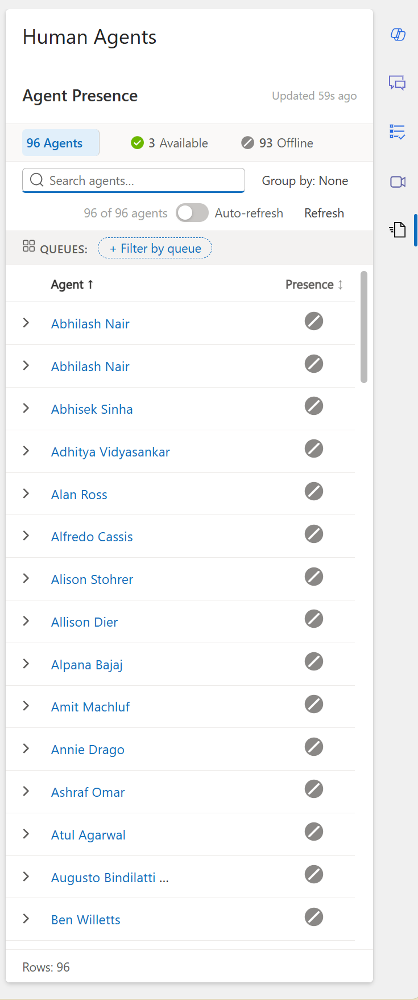
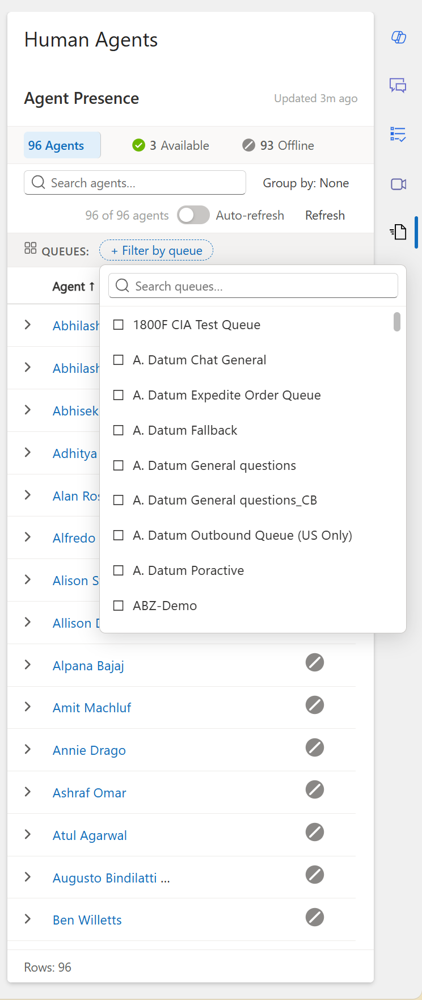
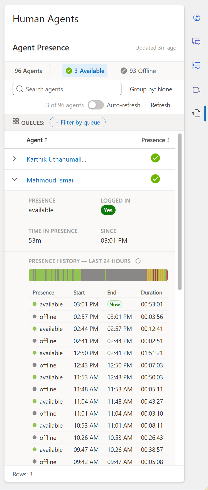
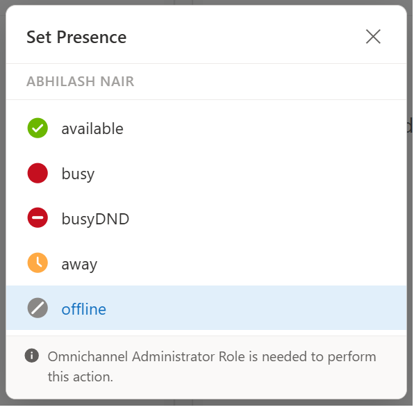
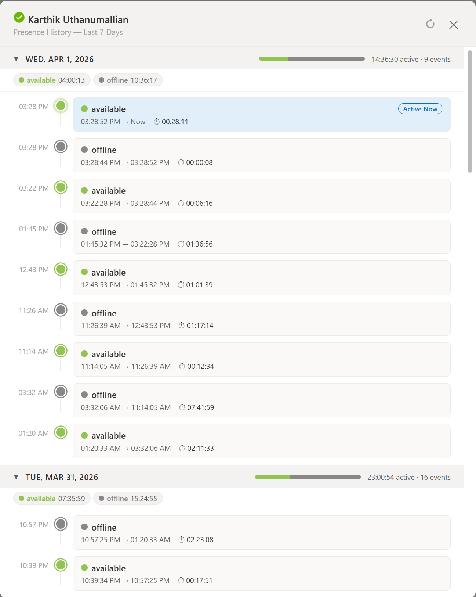
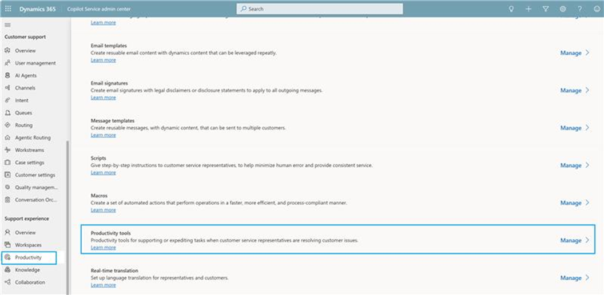
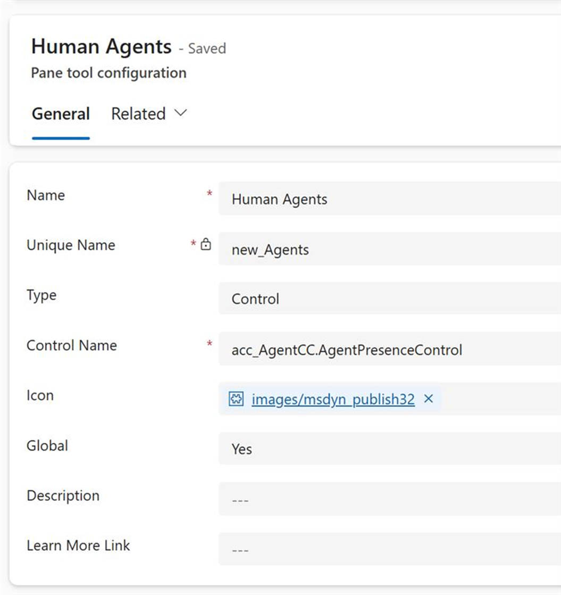
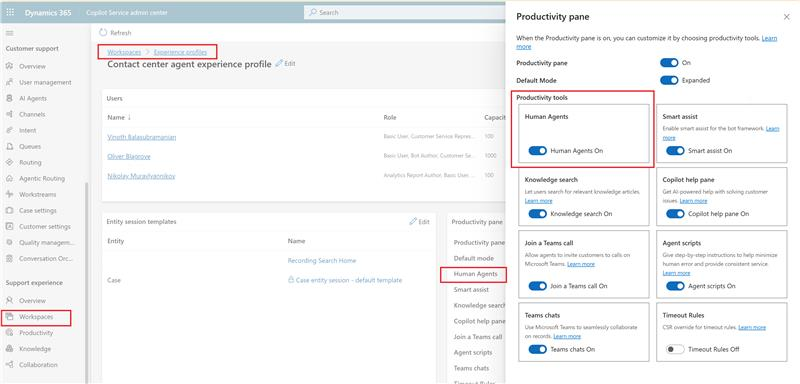

<div align="center">


*Crafted with care for contact center excellence*

</div>

# Agent Presence Control

> **Dynamics 365 Contact Center — Real-Time Agent Presence Monitoring PCF Control**

---

| Field | Value |
|-------|-------|
| **Solution Unique Name** | `AgentPresenceControlSolution` |
| **Version** | 1.0 |
| **Publisher** | AgentCC (prefix: `acc_`, option value prefix: `17282`) |
| **Target Application** | Customer Service workspace, Contact Center workspace |
| **Platform** | Dynamics 365 Customer Service / Omnichannel / Power Platform |
| **Control Type** | PCF (Power Apps Component Framework) Virtual Control |
| **Framework** | React 16.14 + Fluent UI React Components v9 |
| **Solution Type** | Managed |
| **Language** | English (LCID 1033) |
| **Last Updated** | 2026-04 |

---

## Table of Contents

1. [Executive Summary](#1-executive-summary)
2. [Screenshots](#2-screenshots)
3. [Business Problem](#3-business-problem)
4. [Solution Overview](#4-solution-overview)
5. [Business Impact & ROI](#5-business-impact--roi)
6. [Features](#6-features)
7. [Architecture](#7-architecture)
8. [Data Sources](#8-data-sources)
9. [Security & Permissions](#9-security--permissions)
10. [Prerequisites](#10-prerequisites)
11. [Deployment Guide](#11-deployment-guide)
12. [Configuration](#12-configuration)
13. [Usage Guide](#13-usage-guide)
14. [Performance](#14-performance)
15. [Known Limitations](#15-known-limitations)
16. [Troubleshooting](#16-troubleshooting)
17. [Version History](#17-version-history)
18. [Contributors](#18-contributors)
19. [License](#19-license)

---

## 1. Executive Summary

The **Agent Presence Control** is a high-performance PCF (Power Apps Component Framework) control that provides **real-time visibility into agent presence status** for Dynamics 365 Contact Center supervisors. It displays all agents' current availability in a responsive, Teams-style grid with filtering, grouping, search, and presence history capabilities.

Supervisors can monitor their entire agent population at a glance, filter by queue membership, and—with appropriate permissions—modify agent presence status directly from the control.

---

## 2. Screenshots

> **Click any thumbnail to view full-size**

<table>
<tr>
<td align="center" width="33%">
<a href="./assets/AgentPresenceHub01.png">

</a>
<br /><b>Main Dashboard</b>
<br /><sub>Real-time presence grid</sub>
</td>
<td align="center" width="33%">
<a href="./assets/AgentPresenceHub02.png">

</a>
<br /><b>Status Filtering</b>
<br /><sub>Queue & presence filters</sub>
</td>
<td align="center" width="33%">
<a href="./assets/AgentPresenceHub03.png">

</a>
<br /><b>Agent Details</b>
<br /><sub>Expanded row with history</sub>
</td>
</tr>
<tr>
<td align="center" width="33%">
<a href="./assets/AgentPresenceHub04.png">

</a>
<br /><b>History Modal</b>
<br /><sub>7-day presence timeline</sub>
</td>
<td align="center" width="33%">
<a href="./assets/AgentPresenceHub05.png">

</a>
<br /><b>Modify Presence</b>
<br /><sub>Supervisor controls</sub>
</td>
<td align="center" width="33%">
</td>
</tr>
</table>

---

## 3. Business Problem

### Current State

Contact center supervisors need to monitor agent availability in real-time to:

- **Manage capacity** — Ensure adequate staffing for incoming customer interactions
- **Identify issues** — Spot agents stuck in incorrect presence states
- **Coach effectively** — Understand time spent in each presence status
- **React to spikes** — Quickly identify available agents during volume surges

#### Pain Points

| # | Pain Point | Impact |
|---|-----------|--------|
| 1 | **No consolidated view** | Supervisors must navigate multiple screens or reports to see agent status |
| 2 | **Delayed updates** | Standard reports refresh slowly; real-time visibility is lacking |
| 3 | **No queue context** | Hard to see which agents are available for specific queues |
| 4 | **Limited history** | No easy way to see how long an agent has been in current status |
| 5 | **Manual intervention** | Changing an agent's presence requires navigating to another app |

### Desired State

- Single, real-time dashboard showing all agents and their presence
- Instant filtering by queue, presence status, or search term
- Clear visualization with Teams-style presence icons
- History timeline showing presence changes over time
- Direct presence modification for authorized supervisors

---

## 4. Solution Overview

### How It Works

```
┌──────────────────────────────────────────────────────────────────┐
│                   AGENT PRESENCE CONTROL (PCF)                   │
│                                                                  │
│  ┌────────────────────────────────────────────────────────────┐  │
│  │  Header: Title + Last Updated + Auto-Refresh Toggle        │  │
│  └────────────────────────────────────────────────────────────┘  │
│  ┌────────────────────────────────────────────────────────────┐  │
│  │  Summary Bar: [42 Agents] 🟢 12 Available | 🔴 8 Busy |    │  │
│  │               🟡 5 Away | ⚫ 17 Offline                    │  │
│  └────────────────────────────────────────────────────────────┘  │
│  ┌────────────────────────────────────────────────────────────┐  │
│  │  Toolbar: [Search...] [Group by: None ▼] [Refresh]         │  │
│  └────────────────────────────────────────────────────────────┘  │
│  ┌────────────────────────────────────────────────────────────┐  │
│  │  Queue Filter Bar: [Billing Support ✕] [+ Add Queue]       │  │
│  └────────────────────────────────────────────────────────────┘  │
│  ┌────────────────────────────────────────────────────────────┐  │
│  │  Virtual-Scrolling Grid                                    │  │
│  │  ┌───┬────────────────┬────────┬───────────┐               │  │
│  │  │ > │ Agent Name     │ [Edit] │ Presence  │               │  │
│  │  ├───┼────────────────┼────────┼───────────┤               │  │
│  │  │ v │ John Smith     │  ✏ 📊 │    🟢     │               │  │
│  │  │   └── Expanded Detail Panel ─────────────┘              │  │
│  │  │       Presence: Available | Since: 10:34 AM             │  │
│  │  │       Logged In: Yes | Duration: 2h 15m                 │  │
│  │  │       ── Presence History (Last 24h) ──                 │  │
│  │  │       [████ Available ████][░ Away ░][██ Busy ██]       │  │
│  │  ├───┼────────────────┼────────┼───────────┤               │  │
│  │  │ > │ Jane Doe       │  ✏ 📊 │    🔴     │               │  │
│  │  └───┴────────────────┴────────┴───────────┘               │  │
│  └────────────────────────────────────────────────────────────┘  │
│  ┌────────────────────────────────────────────────────────────┐  │
│  │  Footer: Rows: 42                                          │  │
│  └────────────────────────────────────────────────────────────┘  │
└──────────────────────────────────────────────────────────────────┘
```

### Key Workflow

1. **Supervisor opens dashboard** → Control loads and fetches all agent statuses
2. **Real-time polling** → Auto-refresh every 10 seconds (optional)
3. **Filter & Search** → Narrow down by queue, presence status, or agent name
4. **Expand row** → View detailed presence info + 24-hour history timeline
5. **Modify presence** (supervisors only) → Click edit icon, select new status
6. **View full history** → Click history icon for 7-day presence modal

---

## 5. Business Impact & ROI

| Benefit | Impact |
|---------|--------|
| **Real-time visibility** | Supervisors see status changes within 10 seconds |
| **Faster response** | Identify available agents instantly during volume spikes |
| **Reduced escalations** | Spot agents in incorrect states before customer impact |
| **Better coaching** | Historical data shows time distribution across statuses |
| **Single pane of glass** | No need to switch between multiple dashboards |

### Quantified ROI

| Metric | Before | After | Improvement |
|--------|--------|-------|-------------|
| Time to find available agent | 30-60 sec | 2-5 sec | **90% faster** |
| Supervisor context switches | 5-8 per hour | 1-2 per hour | **75% reduction** |
| Stuck presence detection | Hours (reactive) | Minutes (proactive) | **Proactive** |

---

## 6. Features

### Core Features

| Feature | Description |
|---------|-------------|
| **Real-time grid** | Displays all agents with their current presence status |
| **Teams-style icons** | Familiar presence indicators (Available, Busy, DND, Away, Offline) |
| **Summary bar** | Clickable status counts for quick filtering |
| **Search** | Filter agents by name with 200ms debounced search |
| **Grouping** | Group by Presence or Logged In status |
| **Queue filtering** | Filter agents by Omnichannel queue membership |
| **Expandable rows** | View detailed info + 24-hour presence history |
| **History modal** | Full 7-day presence history with timeline visualization |
| **Presence modification** | Change agent presence (System Administrator / Omnichannel Supervisor only) |
| **Auto-refresh** | Optional 10-second polling with manual refresh button |
| **Virtual scrolling** | Handles 30,000+ agents with binary-search viewport calculation |

### UI Components

| Component | Purpose |
|-----------|---------|
| **Header bar** | Title, refresh indicator, last updated time |
| **Summary bar** | Status counts with click-to-filter |
| **Toolbar** | Search input, grouping menu, auto-refresh toggle |
| **Queue bar** | Queue pill filters with add/remove |
| **Data grid** | Virtualized table with expandable rows |
| **Presence picker** | Modal for changing agent presence |
| **History modal** | 7-day timeline with day-by-day breakdown |

---

## 7. Architecture

### Technology Stack

| Layer | Technology |
|-------|------------|
| **Control Type** | PCF Virtual Control (React-based) |
| **UI Framework** | React 16.14 |
| **Component Library** | Fluent UI React Components v9 (@fluentui/react-components) |
| **Styling** | Griffel (zero-runtime CSS-in-JS via makeStyles) |
| **Data Access** | PCF WebAPI (`context.webAPI`) |
| **Build** | Webpack (pac pcf push) |

### Component Structure

```
AgentPresenceControl/
├── index.ts              # PCF entry point (init, updateView, destroy)
├── AgentPresenceGrid.tsx # Main React component (1600+ lines)
├── PresenceIcon.tsx      # Teams-style presence SVG icons
└── bundle.js             # Compiled output
```

### Data Flow

```
┌──────────────────────────────┐     ┌──────────────────────────────┐
│  Dataverse                   │     │  PCF Control                 │
│                              │     │                              │
│  msdyn_agentstatus           │◄────│  fetchAllPages() polls       │
│  msdyn_presence              │     │  every 10s (if auto-on)      │
│  msdyn_agentstatushistory    │     │                              │
│  queue / queuemembership     │     │                              │
└──────────────────────────────┘     └──────────────────────────────┘
                                                   │
                                                   ▼
                    ┌─────────────────────────────────────────────────┐
                    │  React State (agents, filters, history)         │
                    │  + Virtual Scroll (binary search for viewport)  │
                    └─────────────────────────────────────────────────┘
```

### Source Code

The full PCF control source code is available for customization and contribution:

| Resource | Description |
|----------|-------------|
| [`SourceCode/AgentPresenceControl.zip`](./SourceCode/AgentPresenceControl.zip) | Source code (TypeScript, configs) |
| [`AgentPresenceControl.zip`](./AgentPresenceControl.zip) | Pre-built solution (ready to import) |
| [`solution/`](./solution/) | Extracted solution files |

### Building from Source

#### Prerequisites

| Tool | Version | Installation |
|------|---------|--------------|
| **Node.js** | 18.x or later | [nodejs.org](https://nodejs.org/) |
| **npm** | 9.x or later | Included with Node.js |
| **Power Platform CLI** | Latest | `npm install -g pac` or [VS Code extension](https://marketplace.visualstudio.com/items?itemName=microsoft-IsvExpTools.powerplatform-vscode) |

#### Step-by-Step Build

```powershell
# 1. Extract source code
Expand-Archive -Path "SourceCode/AgentPresenceControl.zip" -DestinationPath "." -Force
cd AgentPresenceControl

# 2. Install dependencies (restores node_modules from package.json)
npm install

# 3. Build the control (compiles TypeScript → JavaScript)
npm run build

# 4. Test locally in harness (optional)
npm start watch
# Opens browser at https://localhost:8181 with test harness
```

#### Deploying to Dataverse

**Option A: Push directly to environment**

```powershell
# Authenticate to your environment
pac auth create --url https://yourorg.crm.dynamics.com

# Push the control (creates/updates solution automatically)
pac pcf push --publisher-prefix acc
```

**Option B: Package as solution file**

```powershell
# Create solution project
pac solution init --publisher-name AgentCC --publisher-prefix acc

# Add the PCF project reference
pac solution add-reference --path ./AgentPresenceControl

# Build the solution (creates .zip in bin/Debug or bin/Release)
dotnet build

# Import the solution via Power Apps maker portal
```

#### Project Structure

```
AgentPresenceControl/
├── AgentPresenceControl/           # PCF control source
│   ├── index.ts                    # Entry point (init, updateView, destroy)
│   ├── AgentPresenceGrid.tsx       # Main React component (1600+ lines)
│   ├── PresenceIcon.tsx            # Teams-style SVG icons
│   └── ControlManifest.Input.xml   # Control manifest (properties, features)
├── package.json                    # npm dependencies
├── package-lock.json               # Dependency lock file
├── tsconfig.json                   # TypeScript configuration
├── pcfconfig.json                  # PCF configuration
├── AgentPresenceControl.pcfproj    # MSBuild project file
└── eslint.config.mjs               # ESLint configuration
```

#### Customization Tips

| Customization | File | Section |
|---------------|------|---------|
| Polling interval | `AgentPresenceGrid.tsx` | `POLL_INTERVAL_MS` constant |
| Row height | `AgentPresenceGrid.tsx` | `ROW_HEIGHT` constant |
| Presence colors | `AgentPresenceGrid.tsx` | `PRESENCE_COLORS` object |
| Status icons | `PresenceIcon.tsx` | `renderPresenceSvg()` function |
| OData query | `AgentPresenceGrid.tsx` | `ODATA_OPTIONS` constant |

---

## 8. Data Sources

### Dataverse Tables Used

| Table | Purpose |
|-------|---------|
| `msdyn_agentstatus` | Current presence state for each agent |
| `msdyn_presence` | Available presence options (Available, Busy, etc.) |
| `msdyn_agentstatushistory` | Historical presence changes (for history view) |
| `queue` | Omnichannel queues (filtered by `msdyn_isomnichannelqueue = true`) |
| `queuemembership` | Queue-to-agent mapping for queue filtering |
| `systemuser` | Agent details (name, ID, roles for authorization check) |

### OData Query (Agent Status)

```
msdyn_agentstatus
?$select=msdyn_agentstatusid,msdyn_isagentloggedin,msdyn_presencemodifiedon,
         msdyn_presencemodifiedonwithmilliseconds
&$expand=msdyn_agentid($select=systemuserid,fullname,applicationid,isdisabled),
         msdyn_currentpresenceid($select=msdyn_presenceid,msdyn_name,
                                  msdyn_basepresencestatus,msdyn_presencestatustext)
```

### API for Presence Modification

```http
POST /api/data/v9.2/CCaaS_ModifyAgentPresence
Content-Type: application/json

{
  "ApiVersion": "1.0",
  "AgentId": "<agent-system-user-id>",
  "PresenceId": "<target-presence-id>"
}
```

---

## 9. Security & Permissions

### Read Access

Any user with read access to `msdyn_agentstatus` can view the grid. Typically granted to:

- **Omnichannel Supervisor**
- **System Administrator**
- **Custom supervisor roles**

### Modify Presence (Pencil Icon)

The **modify presence** feature is gated by security role check:

| Role | Can Modify |
|------|-----------|
| System Administrator | ✅ Yes |
| Omnichannel Supervisor | ✅ Yes |
| Omnichannel Agent | ❌ No |
| Other roles | ❌ No |

The control checks `systemuser.systemuserroles_association` on load and conditionally renders the edit column.

### Underlying API

`CCaaS_ModifyAgentPresence` is a Dynamics 365 Omnichannel API. It requires:
- **Omnichannel Administrator** privileges to execute
- The agent must be logged in for the change to take effect

---

## 10. Prerequisites

### Platform Requirements

| Requirement | Version |
|-------------|---------|
| Dynamics 365 Customer Service | 2024 Wave 1 or later |
| Omnichannel for Customer Service | Enabled |
| Power Apps environment | Dataverse enabled |
| PCF controls | Enabled in environment |

### Browser Support

| Browser | Supported |
|---------|-----------|
| Microsoft Edge (Chromium) | ✅ Yes |
| Google Chrome | ✅ Yes |
| Firefox | ✅ Yes |
| Safari | ✅ Yes (macOS) |

---

## 11. Deploy uing the Solution Template

### Step 1: Import Solution

1. Navigate to **Power Apps** or **Copilot Service admin center**
2. Go to **Solutions** → **Import Solution**
3. Upload `AgentPresenceControlSolution.zip` from this repository
4. Review dependencies and resolve if needed
5. Complete import and click **Publish All Customizations**

### Step 2: Create Productivity Pane Tool

1. Go to **Copilot Service admin center**
2. Navigate to **Support experience** → **Productivity** → **Productivity tools**
3. Click **New Tool**

**Configuration:**

| Setting | Value |
|---------|-------|
| **Name** | Human Agents |
| **Unique Name** | new_Agents |
| **Type** | Control |
| **Control Name** | `acc_AgentCC.AgentPresenceControl` |
| **Global** | Yes (recommended) |

<div align="center">


*Creating the productivity pane tool with control configuration*
</div>

### Step 3: Enable Tool in Experience Profile

1. Go to **Workspaces** → **Experience Profiles**
2. Open the relevant profile (e.g., default supervisor profile)
3. Navigate to **Productivity Pane** section
4. Click **Add Tool**
5. Select **Human Agents**
6. Enable the toggle
7. **Save** and **Publish**

<div align="center">


*Adding the tool to an experience profile*
</div>

### Step 4: Grant Permissions

Ensure supervisors have at least **read** access to:
- `msdyn_agentstatus`
- `msdyn_presence`
- `msdyn_agentstatushistory`
- `queue`
- `queuemembership`

For presence modification, assign **Omnichannel Administrator** role.

### Validation Checklist

| Step | Verification |
|------|--------------|
| ✅ Solution imported | No errors during import |
| ✅ Tool created | Control name is `acc_AgentCC.AgentPresenceControl` |
| ✅ Tool added to profile | Tool appears in experience profile |
| ✅ Profile assigned to users | Supervisors have the profile |
| ✅ Tool visible | Tool appears in productivity pane |

<div align="center">


*Agent Presence Control visible in the productivity pane*
</div>

---

## 12. Configuration

### Control Properties

| Property | Type | Description |
|----------|------|-------------|
| `sampleProperty` | SingleLine.Text | Placeholder (not currently used) |

### Configurable Constants (Code-Level)

| Constant | Default | Description |
|----------|---------|-------------|
| `POLL_INTERVAL_MS` | 10000 | Auto-refresh interval (10 seconds) |
| `QUEUE_FETCH_CONCURRENCY` | 5 | Max parallel queue membership requests |
| `ROW_HEIGHT` | 37 | Agent row height in pixels |
| `DETAIL_HEIGHT` | 260 | Expanded detail panel height |
| `OVERSCAN` | 8 | Extra rows rendered above/below viewport |

---

## 13. Usage Guide

### Viewing Agent Presence

1. Open the dashboard containing the Agent Presence Control
2. The grid loads automatically with all agents
3. Summary bar shows counts by presence status

### Filtering

| Filter Type | How To |
|-------------|--------|
| By presence | Click a status in the summary bar (e.g., "🟢 12 Available") |
| By queue | Click **+ Filter by queue** → Select queue(s) |
| By name | Type in the search box |
| Clear filters | Click the status again, or click **Clear** in queue bar |

### Grouping

1. Click **Group by: None ▼**
2. Select **Presence** or **Logged In**
3. Groups are collapsed by default; click to expand

### Viewing History

#### Inline History (24 Hours)
1. Click the **▶** expander on any agent row
2. See presence details + timeline bar + history table

#### Full History Modal (7 Days)
1. Hover over an agent row
2. Click the **📊** history icon
3. Modal shows day-by-day breakdown with expandable sections

### Modifying Presence (Supervisors Only)

1. Hover over an agent row
2. Click the **✏️** pencil icon
3. Select the new presence from the modal
4. Presence updates immediately

---

## 14. Performance

### Scalability

| Metric | Capability |
|--------|------------|
| **Agent count** | Tested with 30,000+ agents |
| **Virtual scrolling** | Renders only visible rows + 8 overscan |
| **Polling efficiency** | O(n) diff — only updates state if data changed |
| **Queue filtering** | Parallel fetch with concurrency limit (5) |

### Optimization Techniques

| Technique | Benefit |
|-----------|---------|
| Binary search viewport | O(log n) row lookup for scroll position |
| WeakMap for form state | Memory cleanup on form unload |
| Debounced search | 200ms delay prevents excessive filtering |
| Memoized derived data | Filters/sorts recompute only when deps change |
| Concurrent HTTP limiting | Prevents API throttling on queue selection |

---

## 15. Known Limitations

| Limitation | Workaround |
|------------|------------|
| **Presence modification requires Omnichannel Administrator** | Assign role or use admin to modify |
| **History limited to 7 days** | Query `msdyn_agentstatushistory` directly for older data |
| **Bot users excluded** | By design — bots have `applicationid` set |
| **No offline/PWA support** | Must be online to fetch data |

---

## 16. Troubleshooting

### Grid Shows No Agents

| Cause | Solution |
|-------|----------|
| Missing read permissions | Grant read on `msdyn_agentstatus` |
| No agent status records | Agents must log in at least once to create status records |
| Filter active | Check for active queue or presence filters |

### Presence Modification Fails

| Error | Cause | Solution |
|-------|-------|----------|
| `API error 403` | Missing Omnichannel Administrator | Assign required role |
| `API error 404` | Agent not logged in | Agent must be logged in |
| `API error 500` | Service issue | Check Omnichannel service health |

### Auto-Refresh Not Working

- Ensure the toggle is **ON** (blue)
- Check browser DevTools console for errors
- Verify network connectivity

### History Modal Shows "No Records"

- Agent may not have any presence changes in the last 7 days
- Check if `msdyn_agentstatushistory` has records for the agent

---

## 17. Version History

| Version | Date | Changes |
|---------|------|---------|
| **1.0** | 2026-04 | Initial release: real-time grid, queue filtering, history, presence modification |

---

## 18. Contributors

| Name | Role |
|------|------|
| Vinoth Balasubramanian | Author / Creator |

---

## 19. License

This project is licensed under the **MIT License** — see the [LICENSE](./LICENSE) file for details.

---

<div align="center">

*Built for Dynamics 365 Contact Center — Empowering supervisors with real-time visibility*

</div>
